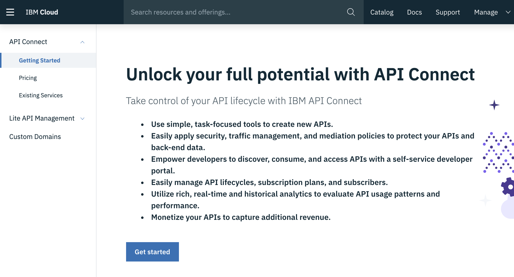

---

copyright:
  years: 2018, 2019
lastupdated: "2019-06-07"

keywords: swift api connect, swagger swift, open api swift, api designer, loopback swift api, create swift backend, swift api parameters, swift api reference

subcollection: swift

---

{:new_window: target="_blank"}
{:shortdesc: .shortdesc}
{:screen: .screen}
{:codeblock: .codeblock}
{:pre: .pre}
{:tip: .tip}

# Adding APIs to iOS apps
{: #api_connect}

You can use API Connect to manage APIs in {{site.data.keyword.cloud}}, whether they are maintained in our out of {{site.data.keyword.cloud_notm}}. Learn to manage your APIs so you can control usage, increase adoption, and track statistics.

## Creating an instance of API Connect
{: #create-apiconnect}

Go to the [{{site.data.keyword.cloud_notm}} catalog](https://{DomainName}/catalog){: new_window}  and create an instance of API Connect to manage your APIs.

Use the `Menu->APIs` to access the API Connect Management console.



If you're defining your own API contract before you start backend, and front end development, use the API Connect tools to accelerate this process. You can work with your digital development team to build and define contract of API between your iOS App and your backend logic. This logic can be delivered by using [{{site.data.keyword.openwhisk}}](/docs/openwhisk?topic=cloud-functions-index#index) or through the [Swift runtime](/docs/runtimes/swift?topic=Swift-swift_runtime#swift_runtime) with Kubernetes or [Cloud Foundry](/docs/cloud-foundry?topic=cloud-foundry-about#about).

Once your API is defined, you can define Open API Specifications (Swagger) in a number of different tools:

- [Swagger Editor](http://editor.swagger.io/){: new_window} 
- [API Designer](https://www.ibm.com/support/knowledgecenter/en/SSFS6T/com.ibm.apic.toolkit.doc/task_apionprem_composing_apis.html){: new_window} 
- [Loopback](https://loopback.io/){: new_window} 

## Defining your managed API
{: #define-apiconnect}

You can define an API proxy that manages the API gateway between your client application, and your backend logic. Use the following steps to create a proxy by using your Open API Specification (Swagger document) YAML or JSON. 

1. Open the `Menu -> APIs` console, and click the API Proxy.
2. Click **API Definition Import YAML or JSON**.
3. Select the YAML or JSON file that you created previously.
4. Save and Expose.

You need to configure the External Endpoint to point to the URL that links to your backend logic application. 

## Creating a Swift backend
{: #create-backend-apiconnect}

You can create your backend Swift app based on this API. 

From the [Apple Development console](https://{DomainName}/developer/appledevelopment/dashboard){: new_window} , perform the following steps:

1. Select **Starter Kits**.
2. Click **Create App**.
3. Select **Swift** as the language.

Select the YAML and JSON file, and then click **Create**. The back end Swift app is created.

You can then **download** the Code or **Deploy**, and clone your GIT repo to your local machine. You can follow the instructions in the Knowledge Guide to open the server-side app in Xcode.

In the **Source** folder, you can see a route that defines the Swift file that created the REST endpoints that map to the API. 

See the following example that uses the `PetStore` Open API:
```swift
import Kitura
import KituraContracts

func initializePet_Routes(app: App) {
    app.router.post("\(basePath)/pet") { request, response, next in
        response.send(json: [:])
        next()
    }

    app.router.put("\(basePath)/pet") { request, response, next in
        response.send(json: [:])
        next()
    }

    app.router.get("\(basePath)/pet/findByStatus") { request, response, next in
        response.send(json: [:])
        next()
    }

    app.router.get("\(basePath)/pet/findByTags") { request, response, next in
        response.send(json: [:])
        next()
    }

    app.router.get("\(basePath)/pet/:petId") { request, response, next in
        response.send(json: [:])
        next()
    }

    app.router.post("\(basePath)/pet/:petId") { request, response, next in
        response.send(json: [:])
        next()
    }

    app.router.delete("\(basePath)/pet/:petId") { request, response, next in
        response.send(json: [:])
        next()
    }

    app.router.post("\(basePath)/pet/:petId/uploadImage") { request, response, next in
        response.send(json: [:])
        next()
    }
}
```
{: codeblock}

Once the API is defined by using {{site.data.keyword.openwhisk_short}} or a full stack Swift runtime, and the API Connect definition is created, you can consume the API in your iOS Apps.

## Consuming the API in an iOS App Mobile App
{: #consume-apiconnect}

To consume the backend API in your iOS App, create a Mobile starter kit by using the Apple Console. Using the Starter Kit view, create an iOS Swift starter kit of any type.

Click **Add service** and select an API. 


The API is added to your iOS App. If you *Download* the code for the App, you can see a folder that is included in the iOS Source folders that is named after the API.

Follow the Knowledge Guide steps to `pod update` any dependant SDKs into you iOS App. 

The iOS App includes a folder with the generated SDK binding for the API. This folder includes the following three subfolders `Assets`,`Source`, and `Docs`. 


In the `Assets` folder, is a file that manages the URL to your API, which by default is `localhost:3000`. You must change the value to reference the API Route. The API definition is made up of an API Name and Route section. Click **Copy** at the end of the route to copy the URL. Check that the *Expose Managed API* option is turned on to enable external clients to make API calls.

  

Open the `PLIST` file and replace the host value with the value that is copied from the API route that enables the SDK to call the API into the {{site.data.keyword.cloud_notm}}.

## Documentation
{: #docs-apiconnect}

When the SDK is included in your iOS App project, a *README.html* file is available in the `Docs` folder. Open the `Docs` folder in an External browser and read the instructions on how to use your project.

## Re-creating the SDK after API Change
{: #change-apiconnect}

If the API changes or new features become available, and {{site.data.keyword.openwhisk}} is added, you can re-create the client SDK by using the `ibmcloud sdk` command. For more information, examples, and syntax help, check out the [SDK Generator](/docs/cli/sdk?topic=cloud-cli-sdk-cli#sdk-cli) documentation.

To enable the creation of an SDK, use the Open API Specification (Swagger) YAML or JSON file. You can retrieve this file by using the API management facilities in the {{site.data.keyword.cloud_notm}}. 

1. Navigate to `Menu -> APIs -> Managed APIs`.
2. Select the API you that want to retrieve the latest Open API Specification from. 
3. Then, select the **Explorer** menu.


4. Select the download icon to download the yaml for the API and save this file in your iOS App project directory.

5. The next step is to run the `ibmcloud sdk` CLI command. 
    ```
    ibmcloud sdk generate --ios --unzip --output ./MyAppFunctions -f ./mobile-bff-functions-1.0.0.yaml SDKMyFunctions
    ```
    {: codeblock}

    The SDK is re-created into your iOS App project directory so you can continue to work with your API.

## Reference
{: #reference-apiconnect}

The following example SDK is created for {{site.data.keyword.openwhisk_short}} from the Starter Kit. You can see each of the Actions and the Swift snippets of code that you can include in your iOS App.

### Default API methods
{: #default-methods-apiconnect}

 * [`getCreate`](#getCreate)
 * [`getDelete`](#getDelete)
 * [`getDeleteall`](#getDeleteall)
 * [`getRead`](#getRead)
 * [`getReadall`](#getReadall)
 * [`getUpdate`](#getUpdate)

### Using `getCreate`
{: #getcreate-apiconnect}

{: #getCreate}

```swift
public static func getCreate(completionHandler: @escaping (_ response: Response?, _ error: Error?) -> Void) -> Void
```
{: codeblock}

#### Parameters for `getCreate`

- **completionHandler** (required)
    - Closure takes as arguments `Response?` and `Error?`.

### Authenticating with `getCreate`
{: #auth-getcreate}

No authentication required

### Example that uses `getCreate`
{: #example-getcreate}

```swift
DefaultAPI.getCreate() { (response, error) in
    guard error == nil else {
        print(error!)
        return
    }
    if let status = response?.statusCode {
        switch status {
        case 0:
            print("Default response")
        default:
            print("Response: \(response?.responseText)")
        }
    }
}
```
{: codeblock}

### Using `getDelete`
{: #getdelete}

```swift
public static func getDelete(completionHandler: @escaping (_ response: Response?, _ error: Error?) -> Void) -> Void
```
{: codeblock}

#### Parameters for `getDelete`

- **completionHandler** (required)
    - Closure takes as arguments `Response?` and `Error?`.

### Authenticating with `getDelete`
{: #auth-getdelete}

No authentication required

### Example that uses `getDelete`
{: #example-getdelete}

```swift
DefaultAPI.getDelete() { (response, error) in
    guard error == nil else {
        print(error!)
        return
    }
    if let status = response?.statusCode {
        switch status {
        case 0:
            print("Default response")
        default:
            print("Response: \(response?.responseText)")
        }
    }
}
```
{: codeblock}

### Using `getDeleteall`
{: #getdeleteall}

```swift
public static func getDeleteall(completionHandler: @escaping (_ response: Response?, _ error: Error?) -> Void) -> Void
```
{: codeblock}

#### Parameters for `getDeleteall`

- **completionHandler** (required)
    - Closure takes as arguments `Response?` and `Error?`.

### Authenticating with `getDeleteall`
{: #auth-getdeleteall}

No authentication required

### Example that uses `getDeleteall`
{: #example-getdeleteall}

```swift
DefaultAPI.getDeleteall() { (response, error) in
    guard error == nil else {
        print(error!)
        return
    }
    if let status = response?.statusCode {
        switch status {
        case 0:
            print("Default response")
        default:
            print("Response: \(response?.responseText)")
        }
    }
}
```
{: codeblock}

### Using `getRead`
{: #getread}

```swift
public static func getRead(completionHandler: @escaping (_ response: Response?, _ error: Error?) -> Void) -> Void
```
{: codeblock}

#### Parameters for `getRead`

- **completionHandler** (required)
    - Closure takes as arguments `Response?` and `Error?`.

### Authenticating with `getRead`
{: #auth-getread}

No authentication required

### Example that uses `getRead`
{: #example-getread}

```swift
DefaultAPI.getRead() { (response, error) in
    guard error == nil else {
        print(error!)
        return
    }
    if let status = response?.statusCode {
        switch status {
        case 0:
            print("Default response")
        default:
            print("Response: \(response?.responseText)")
        }
    }
}
```
{: codeblock}

### Using `getReadall`
{: #getreadall}

```swift
public static func getReadall(completionHandler: @escaping (_ response: Response?, _ error: Error?) -> Void) -> Void
```
{: codeblock}

#### Parameters for `getReadall`

- **completionHandler** (required)
    - Closure takes as arguments `Response?` and `Error?`.

### Authenticating with `getReadall`
{: #auth-getreadall}

No authentication required

### Example that uses `getReadall`
{: #example-getreadall}

```swift
DefaultAPI.getReadall() { (response, error) in
    guard error == nil else {
        print(error!)
        return
    }
    if let status = response?.statusCode {
        switch status {
        case 0:
            print("Default response")
        default:
            print("Response: \(response?.responseText)")
        }
    }
}
```
{: codeblock}

### Using `getUpdate`
{: #getupdate}

```swift
public static func getUpdate(completionHandler: @escaping (_ response: Response?, _ error: Error?) -> Void) -> Void
```
{: codeblock}

#### Parameters for `getUpdate`

- **completionHandler** (required)
    - Closure takes as arguments `Response?` and `Error?`.

### Authenticating with `getUpdate`
{: #auth-getupdate}

No authentication required

### Example that uses `getUpdate`
{: #example-getupdate}

```swift
DefaultAPI.getUpdate() { (response, error) in
    guard error == nil else {
        print(error!)
        return
    }
    if let status = response?.statusCode {
        switch status {
        case 0:
            print("Default response")
        default:
            print("Response: \(response?.responseText)")
        }
    }
}
```
{: codeblock}

