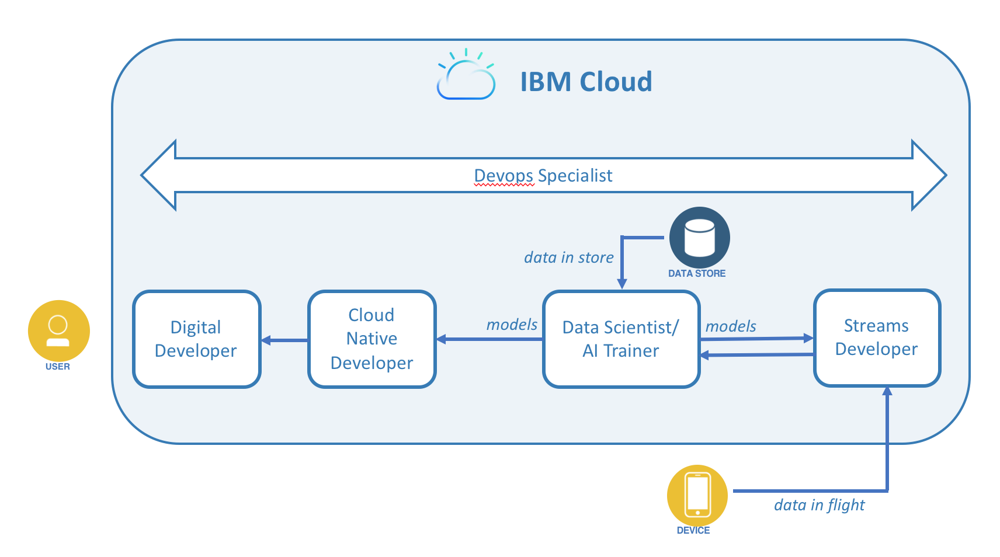

---

copyright:
  years: 2018
lastupdated: "2018-05-15"

---
{:new_window: target="_blank"}
{:shortdesc: .shortdesc}
{:screen: .screen}
{:codeblock: .codeblock}
{:pre: .pre}
{:note:.deprecated}
{:tip .tip}

# Apple Development and {{site.data.keyword.cloud_notm}}
{: #ios_dev}

{{site.data.keyword.cloud_notm}} offers solutions and services to empower Swift developers and applications with the security, AI, and value demanded by your customers. With a broad portfolio of offerings and SDKs, you can leverage these services, and bring your cutting-edge applications to market quickly.

## Modern Apps: A Melting Pot of Skills
{: #skills}

Today, users expect more from their applications than ever before. They want apps to deliver deep insights, and real-time data to be always-available, and to match their individual preferences more closely with each passing day. To meet these expectations, app creators need to bring together many different skill sets.  For example, a sophisticated cognitive application might require contributions from digital developers, cloud native developers, streams developers, data scientists, and devop specialists.

 

* *Digital developers* author for a particular digital channel such as mobile web, voice, and chat. Digital developers are typically focused on use cases and directly meeting users' needs as a comprehensive experience. 
* *Cloud native developers* specialize in constructing and interconnecting cloud components. Microservice and back-end-for-frontend authors fall into this category. 
* *Streams developers* focus on processing and gaining insight from streams of data. For example, as streams developer might analyze and initiate action on incoming text, speech, or video streams. 
* *Data scientists* utilize analytics and machine learning to produce predictive models. These models are used in business metrics and also provide deep insights to application users.
* *Devops specialists* are experts in resolving deployment and toolchain issues, and they can serve one or many development teams. For simple apps, dedicated specialists are usually not needed as development team members manage devops with the squad. But for complex enterprise applications with many dependencies, devops specialists are essential in keeping your production app running smoothly.
{: tip}

## One Development Platform: IBM Cloud
{: #platform}

 

The developer capabilities that are built in to {{site.data.keyword.cloud_notm}}, align to various skill sets and provide one platform to produce, deliver, run, and manage your app. For example, from the cognitive app mentioned, the following {{site.data.keyword.cloud_notm}} are of interest:

* The **{{site.data.keyword.cloud_notm}} Developer Experience** is not a service, but rather is a set of capabilities on {{site.data.keyword.cloud_notm}} that helps digital and cloud native developers to start building production-ready apps. It includes automatic provisioning of services, and one-click deployment to a devops toolchain. More on this in the Starting Right section.

* [**IBM Watson Data Platform**](https://console.bluemix.net/developer/dataplatform/dashboard) <!--[IBM Watson Data Platform](https://dataplatform.ibm.com)--> makes it simple to assemble data collections, refine the data, then visualize, discover insights, and build models for use in your cognitive app.

* [**IBM Streaming Analytics**](../services/StreamingAnalytics/index.html#gettingstarted) helps wrangle and analyze data streams. It is an advanced analytic platform that you can use to ingest, analyze, and correlate information as it arrives from different types of data sources in real time.

* The [**{{site.data.keyword.cloud_notm}} Continuous Delivery service**](../services/ContinuousDelivery/index.html#cd_getting_started) lets you easily set up a devops toolchain to automate continuous delivery of your app. You can easily enhance the toolchain to include management functions like monitoring, logging, tracking, and alerting. You can even apply advanced machine learning to your toolchain by using the [DevOps Insights service](../services/DevOpsInsights/index.html#gettingstarted).

The {{site.data.keyword.cloud_notm}} platform offers many more capabilities and can be used {{site.data.keyword.cloud_notm}} as your comprehensive development platform.

## Overview of {{site.data.keyword.cloud_notm}} Capabilities
{: #capabilities}

The {{site.data.keyword.cloud}} Developer Experience is not a service, but rather a set of capabilities in the {{site.data.keyword.cloud_notm}} platform that gets you started building apps the "right" way in minutes. Essential elements of the Developer Experience are:

* A set of topic or channel-centric developer consoles found across the {{site.data.keyword.cloud_notm}} platform.
* Specific use-case starter kits that produce production-ready starter apps in various languages and architectural patterns.
* Automatic provisioning of services.
* Manage app components by using a portable app project structure.
* One-click creation of a [devops toolchain](../services/ContinuousDelivery/index.html#cd_getting_started).

To understand how {{site.data.keyword.cloud_notm}} Developer Experience can help you rapidly build high-quality production-ready apps, see the following elements in more detail.

##Developer Consoles
{: #developer_consoles}

The {{site.data.keyword.cloud_notm}} Developer Experience manifests in various developer consoles across the {{site.data.keyword.cloud_notm}} platform. Each console represents an area of interest (like Watson, Security, or Finance) or a digital channel (like Mobile or Web Apps). The [{{site.data.keyword.cloud_notm}} Developer Console for Apple](https://console.bluemix.net/developer/appledevelopment) was developed for Apple developers to be able to quickly experiment with applications, and services, backed by the {{site.data.keyword.cloud_notm}} platform. You can access these consoles by clicking the menu icon in the {{site.data.keyword.cloud_notm}} console. For example, see the following developer consoles:

* [Watson developer console](https://console.bluemix.net/developer/watson)
* [Mobile developer console](https://console.bluemix.net/developer/mobile)
* [Web App developer console](https://console.bluemix.net/developer/appservice)
* [Security developer console](https://console.bluemix.net/developer/security)
<!--* [Watson Data Platform developer console](https://console.bluemix.net/developer/dataplatform)-->
* [Finance developer console](https://console.bluemix.net/developer/finance)

<!--Cloud native development is the process of developing apps that are optimized to leverage capabilities engendered from running on the cloud.  Flexibility, portability, scaling, rapid development, continuous delivery, and a close coupling development and operations ("devops) are characteristics of cloud applications. The {{site.data.keyword.cloud}} Developer Experience quickly gets you started building cloud native applications that are ready for team development and bound for production use.-->

<!--   *Overview of elements of the {{site.data.keyword.cloud_notm}} Developer Experience*-->

Each developer console provides starter kits relevant to that console's focus area, offering a consistent, intuitive workflow, and then enables you to create a working production-ready app project in minutes.

## App Projects
{: #apps}

An app project is the association of code, data, services, and toolchains that comprise your app. For example, the {{site.data.keyword.cloud_notm}} mobile app shown in the following image contains code for application and backend logic, data storage, analytics, security services, and is set up for continuous delivery:

 You can create and manage an app project by using any {{site.data.keyword.cloud_notm}} developer console.  App projects are created from [Starter Kits](starter_kit/starter_kits.html).
