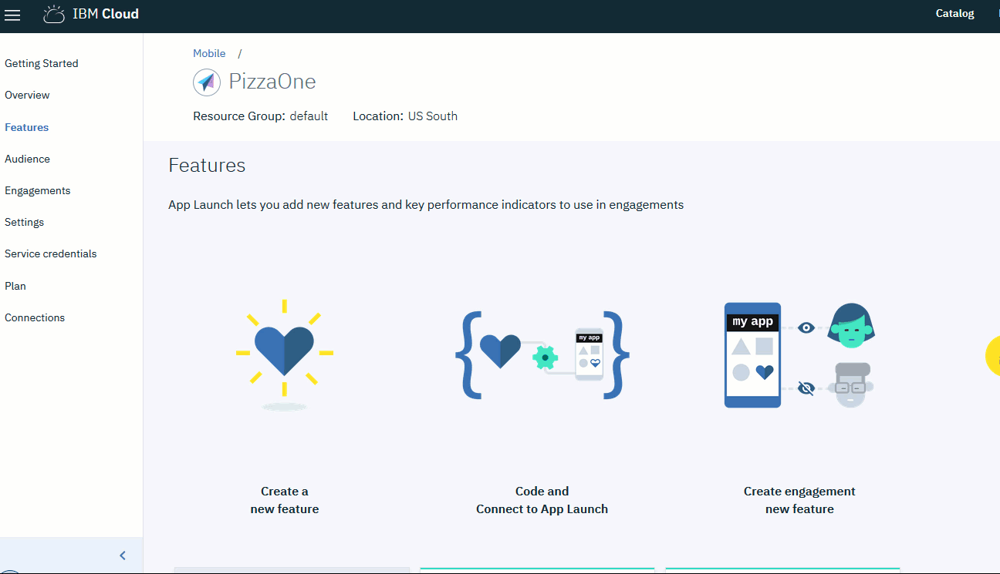
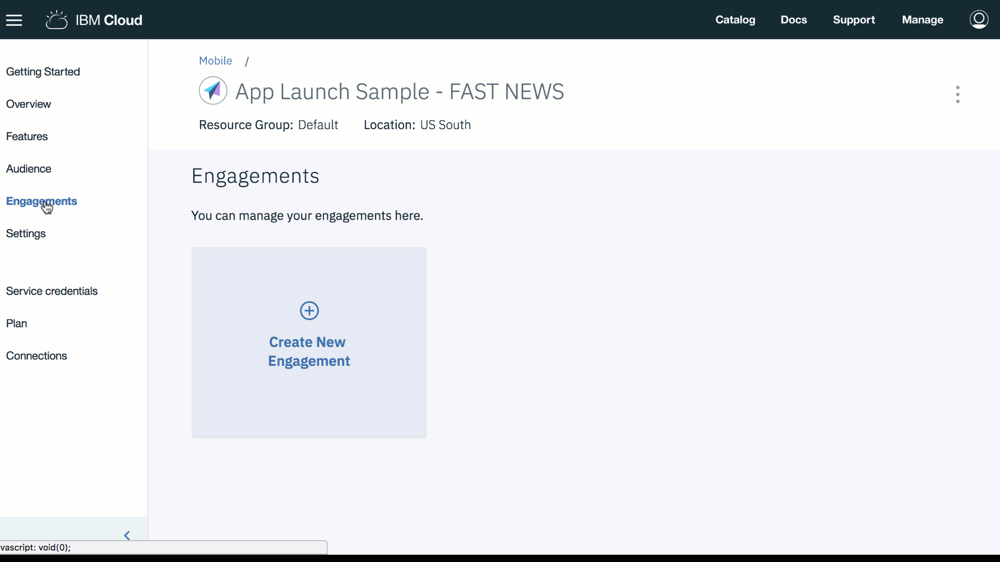

---

copyright:
  years: 2018
lastupdated: "2018-08-07"

---

{:new_window: target="_blank"}
{:shortdesc: .shortdesc}
{:screen: .screen}
{:codeblock: .codeblock}
{:pre: .pre}
{:gif: data-image-type='gif'}

# Releases von App-Features verwalten
{: #mobile_applaunch}

Mithilfe von {{site.data.keyword.engage_full}} können Entwickler
attraktive Apps erstellen, indem sie die Reichweite und das Rollout von
App-Features steuern, die messbare Metriken bereitstellen können. Der Service
unterstützt Entwickler dabei, die heutzutage bestehende Kopplung zwischen dem
Rollout eines App-Features und den App-Aktualisierungen für die Produktion
aufzuheben. Jetzt können Sie Features veröffentlichen, ohne sie der Produktion
zugänglich zu machen, und auf diese Weise neue Versionen einer App nach und
nach kontrolliert freigeben. Mit dem
{{site.data.keyword.engage_short}}-Service haben App-Eigner die
vollständige Kontrolle über das Feature-Rollout für ein Zielsegment.

Der {{site.data.keyword.engage_short}}-Service definiert ein
Feature, erstellt auf der Basis von Geräteplattformen (inklusive angepassten
Zielgruppenattributen) eine Zielguppe und definiert schließlich ein Projekt,
das den Zeitpunkt und die Verteilung des Features koordiniert. Nachdem SDKs
zusammen mit den in der Anwendung integrierten Feature- und Metrikattributen
genutzt wurden, beginnt der Service mit dem Messen der Zielgruppenerfahrungen. Anhand
dieser Informationen können Sie nun Ihre App nutzen, um angepasste
Kundenprojekte für unterschiedliche Kategorien Ihrer App-Benutzer zu erstellen.

 Abbildung 1. Überblick über den Lebenszyklus des

{{site.data.keyword.engage_short}}-Service

Die {{site.data.keyword.engage_short}}-Services bieten die
folgenden Features:

 - **Beschleunigte Featurebereitstellung**

    Die Bereitstellung von Features für Ihre App wird durch
kontrollierte Releases beschleunigt, die Risiken mindern. Wenn Sie Features für eine Teilmenge von Zielgruppensegmenten freigeben, können Sie größere Rollout- oder Rollback-Entscheidungen auf der Basis von Echtzeitfeedbacks treffen. Sie können Feature-Rollouts von regulären Releasezyklen abtrennen.

 - **Zielgruppensegmentierung**

    Sie können Benutzersegmente definieren, die auf demografischen,
kontextorientierten und verhaltensbezogenen Attributen basieren. Alternativ
können Features auch für einen bestimmten Prozentsatz der Benutzerbasis
implementiert werden. Für jedes Feature und jeden clientseitigen Code können
KPIs (Key Performance Indicator, wesentlicher Leistungsindikator) definiert
werden, um die Ergebnisse zu messen.

 - **Auf Kontext basierende Anwendungsanpassung**

    Anwendungsverhalten, Benutzerschnittstelle und Benachrichtigungen
können für bestimmte Zielgruppensegmente angepasst werden. Beispielsweise kann
ein App-Hintergrund je nach Benutzerstandort geändert werden. Diese
Benutzerpersonalisierung führt zu einer stärkeren Bindung der Benutzer in
Bezug auf die
Anwendung.

 - **A/B-Testfeatures**

    Verlässlichkeit durch Experimente: Sie können zwei Varianten von
Anwendungsfeatures miteinander vergleichen, indem Sie sie gleichzeitig
implementieren. Ihre Entscheidungen können Sie aufgrund von realen Fakten
treffen.

 - **Erhöhung der Kundenbindung**

    Sie können die Kundenbindung fördern: Benachrichtigungen können
sich an alle Anwendungsbenutzer oder an eine bestimmte Gruppe von Benutzern und
Geräten richten. Sie haben die Möglichkeit, einen Zeitplan für Nachrichten zu
definieren. Die Benutzerinteraktion spielt eine wesentliche Rolle bei
Kundenbeziehungen.

## Vorbereitende Schritte

Stellen Sie zunächst sicher, dass die folgenden Voraussetzungen gegeben
sind:

 - iOS 10+
 - Xcode 9
 - Swift 3.2 - 4
 - Cocoapods oder Carthage

## Schritt 1. Instanz von {{site.data.keyword.engage_short}}
erstellen
{: ##app_launch_create}

1. Klicken Sie im {{site.data.keyword.cloud_notm}}-Katalog auf
**Mobile** > **App Launch**. Die Anzeige
für die Servicekonfiguration wird geöffnet.
2. Vergeben Sie für die Serviceinstanz einen Namen oder verwenden Sie
den voreingestellten Namen.
3. Klicken Sie auf **Erstellen**.
4. Klicken Sie im Navigationsbereich auf
**Verbindungen**, um eine App auszuwählen und an Ihren
Service zu binden. Falls Sie während der Erstellung keine Bindung herstellen,
können Sie Ihre App auch später an die Serviceinstanz binden.

## Schritt 2. App initialisieren
{: #step2}
Der Service stellt plattformspezifische SDKs bereit, um die
Anwendungsentwicklung zu vereinfachen. Die
{{site.data.keyword.cloud_notm}}-Swift-SDKs für Mobile-Services können
entweder mit Cocoapods oder Carthage installiert werden. 

1. Klicken Sie auf **Einstellungen**.
2. Installieren Sie das
[SDK](https://github.com/ibm-bluemix-mobile-services/bms-clientsdk-swift-applaunch). Weitere
Informationen enthält die Readme-Datei, in der auch die Installation und
technische Konzepte erläutert werden.
3. Kopieren Sie die Konfigurationsschlüssel, um Ihre App zu
initialisieren. Verwenden Sie den geheimen App-Schlüssel, die App-GUID und den
geheimen Clientschlüssel, um Ihre App zu konfigurieren und Kundenprojekte zu
erstellen.

## Schritt 3. Feature erstellen
{: #step3}

Der {{site.data.keyword.engage_short}}-Service erstellt Features
und testet die Reaktionen darauf.

{: gif}

Gehen Sie zum Erstellen eines Features wie folgt
vor: 
1. Klicken Sie im Navigationsbereich auf **Features** > **Neues Feature erstellen**.
2. Aktualisieren Sie das Formular "Neues Feature und Metriken erstellen"
mit dem Namen und der Beschreibung eines Features. Hier können Sie auch die
Eigenschaften des Features definieren und Metriken hinzufügen, die die Wirkung
Ihres Kundenprojekts messen. Klicken Sie auf
**Massenbearbeitung**, um mehrere Eigenschaften durch eine
JSON-Bearbeitung hinzuzufügen.
3. Klicken Sie auf **Erstellen**. Das neue Feature
wird in der Anzeige "Features" angezeigt.
4. Aktivieren Sie das Feature, nachdem es entwickelt wurde.
5. Um ein Feature zur Verwendung als Kundenprojekt zu aktivieren,
klicken Sie auf das von Ihnen erstellte Feature.
6. Wählen Sie im Fenster "Featuredetails" aus, den Status Ihres Features
in **Bereit** zu aktualisieren.
7. Klicken Sie auf **Status aktualisieren**.
8. Aktualisieren Sie Ihre App, damit die neu erstellten Attribute und
Feature-Codes in Ihre iOS-App einbezogen werden.
9. Das Feature kann jetzt verwendet werden.

Im Fenster "Featuredetails" können Sie das Feature als JSON-Datei
exportieren, die in der Clientanwendung zum Laden der Standardwerte verwendet
werden kann.

## Schritt 4. Zielgruppe erstellen
{: #step4}

{: gif}

Gehen Sie zum Erstellen einer Zielgruppe wie folgt vor:

1. Erstellen Sie ein **Zielgruppenattribut**:

	a. Klicken Sie auf **Zielgruppe** >
**Attribut erstellen**.
	b. Geben Sie die folgenden Werte an:
		- **Name**: Geben Sie einen geeigneten Namen für das Attribut an.
		- **Beschreibung**: Geben Sie eine Kurzbeschreibung
des Attributs an.
		- **Typ**: Wählen Sie den Attributtyp aus.
		- **Zulässige Werte**: Geben Sie die Attributwerte ein, die Sie verwenden möchten.

  Je nach Bedarf können Sie - wie in der folgenden Abbildung aufgeführt -
mehrere Zielgruppenattribute erstellen.

2. Erstellen Sie eine **Zielgruppe**:

	a. Klicken Sie auf **Zielgruppe erstellen**.
	b. Geben Sie im Fenster "Neue Zielgruppe" einen geeigneten Namen und
eine Beschreibung an.
	c. Wählen Sie ein Attribut aus und klicken Sie auf **Hinzufügen**.
	d. Wählen Sie unter den aufgelisteten Attributen die erforderlichen
Optionen aus.
	e. Klicken Sie auf **Speichern**.

Nun können Sie ein Kundenprojekt erstellen.

## Schritt 5. Kundenprojekt erstellen

Ein Kundenprojekt ist die Instanziierung eines Features mit
initialisierten Eigenschaften, die einer der vordefinierten Zielgruppen
zugeordnet wird. Zur Erstellung eines Kundenprojekts können Sie entweder die
**Featuresteuerung** oder das **App-interne
Messaging** verwenden.

### Funktion "Featuresteuerung" aktivieren

Bei einem solchen Kundenprojekt kann ein App-Eigner die Sichtbarkeit
eines Features steuern, indem es zur Laufzeit aktiviert oder inaktiviert wird. Ein
Feature kann für alle Anwendungsbenutzer oder für eine bestimmte Gruppe von
Benutzern und Geräten aktiviert bzw. inaktiviert werden.

Durch die Definition eines Start- oder Endzeitpunkts (Datum und Uhrzeit)
können Feature-Rollouts terminiert und koordiniert werden. Sie können auch
einen bestimmten Tag auswählen, an dem ein definiertes Feature aktiviert oder
inaktiviert werden soll.

{: gif}

Gehen Sie folgendermaßen vor, um ein Kundenprojekt unter Verwendung der
Featuresteuerung zu erstellen:

1. Erstellen Sie das Kundenprojekt mit einem der folgenden Verfahren:
	- Klicken Sie im Navigationsbereich auf **Kundenprojekte**.
	- Wählen Sie für das neu von Ihnen erstellte Feature die Option **Kundenprojekte erstellen** aus.
	- Klicken Sie im Navigationsbereich auf **Übersicht** > **Neues Kundenprojekt erstellen**.

  Das Fenster "Neues Kundenprojekt" wird angezeigt.

2. Geben Sie einen Namen und eine Beschreibung für Ihr neues
Kundenprojekt an. Vergeben Sie unbedingt einen eindeutigen Namen für das
Kundenprojekt und verwenden Sie keinen der Namen, der bereits in der Liste
"Kundenprojekte" enthalten ist.

	a. Wählen Sie als **Kundenprojekttyp** die
Einstellung **Featuresteuerung** aus.
	b. Wenn Sie ein gesteuertes Experiment mit mehreren Varianten des
Features durchführen möchten, wählen Sie die Option
**A/B-Test** bei **Experimenttyp
auswählen** aus. Klicken Sie auf **Weiter**.

3. Wählen Sie das von Ihnen erstellte Feature aus. Sie können auch die
Varianten hinzufügen und definieren, mit denen Sie experimentieren möchten. 
Klicken Sie auf **Weiter**.

4. Wählen Sie eine Zielgruppe aus. Klicken Sie auf
**Weiter**.

5. Definieren Sie einen Auslöser, indem Sie "Zeit" und dann ein Datum
oder eine Uhrzeit für den
**Start** und ein Datum oder eine
Uhrzeit für das **Ende** auswählen. Klicken Sie auf
**Speichern**.

  Das neue Kundenprojekt wird nun im Fenster "Kundenprojektdetails"
angezeigt.

Jetzt können Sie die
[Leistung](/docs/services/app-launch/app_measure_performance.html#applaunch_type)
Ihres Kundenprojekts messen.

### Funktion "App-internes Messaging" aktivieren

Bei einem solchen Kundenprojekt kann ein App-Eigner Benachrichtigungen an
die App-Benutzer senden, während sie die Anwendung aktiv nutzen.

Nachrichten können sich an alle Anwendungsbenutzer oder an eine
bestimmte Gruppe von Benutzern und Geräten richten. Für jede Nachricht, die Sie
an den Service übergeben, empfängt die Zielgruppe eine Benachrichtigung.

App-interne Nachrichten können durch die Angabe eines Start- oder
Endzeitpunkts (Datum und Uhrzeit) terminiert werden. Als Basis für die
Terminierung können Sie auch ein Ereignis verwenden. Diese Nachrichten sind
stärker angepasst, da sie unter anderem auf den Analyseerkenntnissen über Auswahl,
Interaktionen, Gerät, Anwendungsprotokollen des Benutzers basieren.

Verwendungszwecke von App-internen Nachrichten:

- Versand von angepassten Nachrichten
- Versand von Nachrichten an Benutzer, die Push-Benachrichtigungen
ausgeschaltet haben
- Anforderung einer Rückmeldung oder Aufnahme eines Dialogs mit Benutzern
- Versand von relevanten Nachrichten durch Erkenntnisse über vom Benutzer durchgeführte Suchvorgänge
- Bindung von aktiven und treuen Kunden
- Benachrichtigung von Benutzern über App-Updates (Einführung eines
neuen Features) usw.

{: gif}

Gehen Sie folgendermaßen vor, um ein Kundenprojekt mit Verwendung der
Messagingoption zu erstellen:

1. Erstellen Sie das Kundenprojekt mit einem der folgenden Verfahren:
	- Klicken Sie im Navigationsbereich auf
**Kundenprojekte**.
	- Wählen Sie für das neu von Ihnen erstellte Feature die Option
**Kundenprojekt erstellen** aus.
	- Klicken Sie im Navigationsbereich auf
**Übersicht** > **Neues Kundenprojekt
erstellen**.

  Das Fenster "Neues Kundenprojekt" wird angezeigt.

2. Geben Sie einen Namen und eine Beschreibung für Ihr neues
Kundenprojekt an. Vergeben Sie unbedingt einen eindeutigen Namen für das
Kundenprojekt und verwenden Sie keinen der Namen, der bereits in der Liste
"Kundenprojekte" enthalten ist.

	a. Wählen Sie als **Kundenprojekttyp** die
Einstellung **App-internes Messaging** aus.
	b. Wenn Sie ein gesteuertes Experiment mit mehreren Varianten der
Messagingfunktion durchführen möchten, wählen Sie die Option
**A/B-Test** bei **Experimenttyp
auswählen** aus. Klicken Sie auf **Weiter**.

3. Geben Sie die Nachrichteneigenschaften ein und klicken Sie auf **Weiter**.

4. Wählen Sie die **Zielgruppe** und den Prozentsatz
der Zielgruppe aus, die Sie erreichen wollen. Klicken Sie auf
**Weiter**.

5. Definieren Sie einen Auslöser, indem Sie **Datum und Uhrzeit
für Start/Ende** auswählen.

6. Wählen Sie **Ereignis** aus und klicken Sie
auf **Weiter**.

7. Ordnen Sie die Elemente den Metriken zu, die Sie messen wollen. Wählen
Sie ein Element aus und geben Sie die Metrikdetails ein. Klicken Sie auf
**Speichern**.

  Das neue Kundenprojekt wird nun im Fenster "Kundenprojektdetails"
angezeigt.

Jetzt können Sie die
[Leistung](/docs/services/app-launch/app_measure_performance.html#applaunch_type)
Ihres Kundenprojekts messen.

### Quick Links

Die folgenden Links vermitteln Ihnen Einblicke und Kenntnisse über die
Features von {{site.data.keyword.engage_short}}:

 - Probieren Sie den
[Service](https://console.bluemix.net/catalog/services/app-launch)
aus.
 - [Blogs
und Videos](/docs/services/app-launch/relatedlinks.html#blogs-and-videos)
 - Weitere Informationen finden Sie in der [Dokumentation](/docs/services/app-launch/index.html#gettingstartedtemplate).
