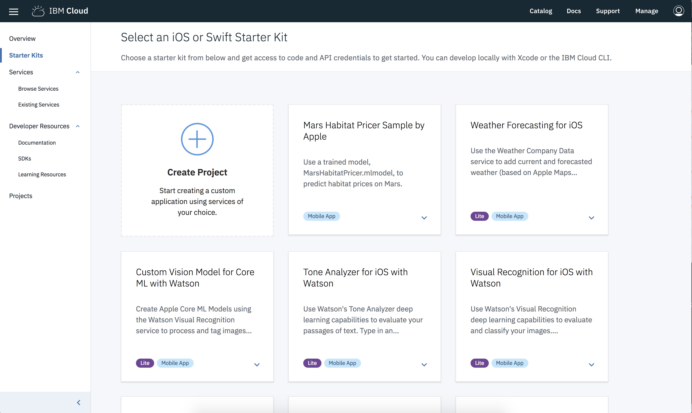

---

copyright:
  years: 2018
lastupdated: "2018-08-08"

---
{:new_window: target="_blank"}
{:shortdesc: .shortdesc}
{:screen: .screen}
{:codeblock: .codeblock}
{:pre: .pre}
{:tip: .tip}

# Swift-Apps mit Starter-Kits erstellen
{: #intro}

In der {{site.data.keyword.cloud_notm}}-Entwicklerkonsole für
Apple
können Apple-Entwickler ausgehend von verschiedenen Starter-Kits Apps
erstellen, bereitstellen, mit wichtigen
{{site.data.keyword.cloud_notm}}-optimierten Services verbinden und
anschließend umgehend funktionsfähigen Code herunterladen oder die
kontinuierliche Bereitstellung konfigurieren. Benutzer können Ihre App
erstellen, anzeigen, konfigurieren und verwalten sowie den Code Ihrer App
herunterladen. Die Verwendung der Starter-Kits ermöglicht es Ihnen,
{{site.data.keyword.cloud_notm}}-Services mit einer brandneuen App
zügig auszuwerten und zu testen.

Wollen Sie gleich loslegen? In der [{{site.data.keyword.cloud_notm}}-Entwicklerkonsole für Apple](https://console.bluemix.net/developer/appledevelopment/starter-kits) können Sie sofort anfangen.
{: tip}

## Was ist ein Starter-Kit?
{: #starter_kits}

Bei {{site.data.keyword.cloud_notm}} Developer Experience können
Sie unter verschiedenen Starter-Kits wählen. Starter-Kits weisen
{{site.data.keyword.cloud_notm}} an, in der Sprache Ihrer Wahl ein Gerüst
für eine einsatzfähige App dynamisch zu assemblieren, das für die
Cloudbereitstellung vorbereitet ist. Jedes Starter-Kit deckt eine Sprache, ein
Framework und ein Muster für einen bestimmten realistischen Anwendungsfall ab,
wodurch Sie Code wiederverwenden können, statt ihn neu erfinden zu müssen.

Starter-Kits sind einsatzbereit und dienen schwerpunktmäßig zur
Demonstration einer wichtigen Musterimplementierung unter Verwendung einer
Laufzeit (z. B. Swift). In einigen Fällen bieten Starter-Kits eine einfache
Funktionalität für den Benutzer, um die Integration des Service
hervorzuheben. In anderen Fällen stellen Starter-Kits eine anpassbare
Implementierung für einen komplexeren Anwendungsfall dar.

Starter-Kits enthalten Anweisungen, anhand derer
{{site.data.keyword.cloud_notm}} automatisch Apps erstellen kann, die
mit einem Gerüst und mit portierbarem Code versehen sind, sowie die Ressourcen
angeben kann, die automatisch bereitgestellt werden müssen, wenn Sie eine App
aus dem Starter-Kit erstellen.

## {{site.data.keyword.cloud_notm}}-Entwicklerkonsole für Apple
verwenden
{: #journey}

In der {{site.data.keyword.cloud_notm}}-Entwicklerkonsole für
Apple erhalten Sie einen nahtlosen Pfad zur Erstellung einer
Swift-Starter-App für Ihren speziellen Anwendungsfall. Die Schritte, die Sie
hierzu ausführen könnten, sind nachfolgend beschrieben.

### Übersichtsanzeige
{: #overview_screen}

Die Übersichtsanzeige bietet Ihnen Inhalt, der auf eine Reihe von
Anwendungsfällen wie Watson, Wetter und anderes abgestimmt ist. Ausgehend von
der Übersichtsanzeige können Sie die Dokumentation einsehen, auf
Ausbildungsressourcen zugreifen, Services durchsuchen, unterstützte
Starter-Kits anzeigen oder über einen Link auf eine größere Sammlung von
Starter-Kits zugreifen. Klicken Sie im Navigationsbereich auf der linken Seite
auf `Starter-Kits`, um die Ansicht "Starter-Kits" aufzurufen.

   *Übersichtsanzeige in der {{site.data.keyword.cloud_notm}}-Entwicklerkonsole für Apple*

### Ansicht "Starter-Kits"
{: #starter_kits_view}

Die Ansicht "Starter-Kits" zeigt die Sammlung der Starter-Kits für einen
bestimmten Anwendungsfallbereich. Über verschiedene Links auf der Karte eines
Starter-Kits können Sie Demos und weitere Informationen anzeigen. Durch die
Auswahl eines Starter-Kits können Sie in die Ansicht "App erstellen" wechseln.

   *Ansicht "Starter-Kits" in der {{site.data.keyword.cloud_notm}}-Entwicklerkonsole für Apple*

### Ansicht "App erstellen"
{: #create_new_app_view}

In der Ansicht **App erstellen** können Sie einen
Namen für Ihre App vergeben sowie Bereitstellungs- und Routing-Informationen
angeben. Auf der rechten Seite sind außerdem die Services, die bei der
Erstellung Ihrer App bereitgestellt werden, zusammen mit den für sie
geltenden Preistarifen und Bedingungen zu sehen. Klicken Sie auf
`Erstellen`, um die Ansicht "App-Details" aufzurufen. Falls
Sie noch nicht bei {{site.data.keyword.cloud_notm}} angemeldet sind,
müssen Sie dies jetzt nachholen.

   *Ansicht "Neue App erstellen" in der {{site.data.keyword.cloud_notm}}-Entwicklerkonsole für Apple*

## Ansicht "App-Details"
{: #app_details_view}

In der Ansicht "App-Details" wird eine Liste der Services angezeigt, die
für Ihre App konfiguriert sind. Für jeden Listeneintrag können Sie den
Servicenamen, Links zu weiterführenden Informationen sowie eine Schaltfläche
**Aktionen** anzeigen, auf der drei vertikal angeordnete
Punkte zu sehen sind. Zu den Optionen, die über die Schaltfläche
**Aktionen** angeboten werden, gehören das Entfernen von
Services aus einer App, das Öffnen des Dashboards für einen Service und das
Löschen eines Service. Beim Entfernen einer Serviceinstanz wird die Zuordnung
zu dieser App entfernt; die Serviceinstanz selbst wird nicht gelöscht. In
dieser Ansicht sind darüber hinaus die Serviceberechtigungsnachweise
konsolidiert; Sie müssen daher nicht die Ansichten für jede
einzelne Serviceinstanz aufrufen, um sie abzurufen.

   *Ansicht "App-Details" in der {{site.data.keyword.cloud_notm}}-Entwicklerkonsole für Apple*

In der Ansicht "App-Details" können Sie neue oder vorhandene Services zu
Ihrer App hinzufügen, die nicht Bestandteil des ursprünglichen Starter-Kits
sind. Klicken Sie im Servicelistenfeld auf den Link **Ressource
hinzufügen**, um Services hinzuzufügen. Welche Services verfügbar
sind, richtet sich nach dem Typ der App sowie den Services, die in einer Region
verfügbar sind. Daher können nicht alle Services allen Apps zugeordnet werden.

   *Dialog "Ressource hinzufügen" in der {{site.data.keyword.cloud_notm}}-Entwicklerkonsole für Apple*

In der Ansicht "App-Details" haben Sie zwei Möglichkeiten, auf Ihren Code zuzugreifen:
*  Wählen Sie **Code herunterladen** aus, um den Code für Ihre App zu generieren und herunterzuladen.

### Ansicht "App-Liste"
{: #app_list_view}

In der Ansicht "App-Liste" können Sie alle erstellten Apps auflisten. Ausgehend
von dieser Ansicht können Sie Ihre Apps umbenennen oder löschen. Wenn Sie auf
einen App-Namen klicken, werden Sie zur Ansicht "App-Details" zurückgeführt.

   *Ansicht "App-Liste" in der {{site.data.keyword.cloud_notm}}-Entwicklerkonsole für Apple*

Weitere Informationen sind in den [Lernressourcen zur {{site.data.keyword.cloud_notm}}-Entwicklerkonsole für Apple](https://console.bluemix.net/developer/appledevelopment/learning-resources) verfügbar.
{: tip}
