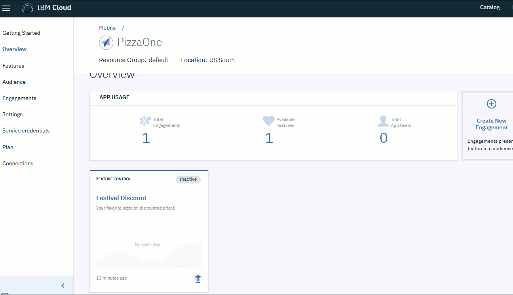

---

copyright:
  years: 2018
lastupdated: "2018-08-07"

---

{:new_window: target="_blank"}
{:shortdesc: .shortdesc}
{:screen: .screen}
{:codeblock: .codeblock}
{:pre: .pre}
{:gif: data-image-type='gif'}

# Gestión de releases de características de app
{: #mobile_applaunch}

{{site.data.keyword.engage_full}} permite a los desarrolladores crear apps interactivas controlando el alcance y la implantación de las características de la app que pueden proporcionar métricas mensurables. El servicio ayuda a los desarrolladores a eliminar el acoplamiento que existe hoy en día entre el despliegue de características de la app y las actualizaciones de la app en producción. Ahora puede publicar características sin exponerlo a la producción para liberar gradualmente nuevas versiones de una app de forma controlada. Con el servicio {{site.data.keyword.engage_short}}, los propietarios de apps tienen un control total sobre la presentación de la característica para un segmento de destino.

El servicio {{site.data.keyword.engage_short}} define una característica, crea público en función de las plataformas de dispositivo (incluidos atributos de público personalizados) y, por último, define la fidelización que coordinará la temporización y el posicionamiento de la característica. Una vez utilizados los SDK junto con los atributos de métrica y característica que se incorporan en la aplicación, el servicio empieza a medir la experiencia del público. De acuerdo con esta información, puede utilizar su app para crear fidelizaciones de cliente personalizadas en diferentes categorías de usuarios de la app.

 Figura 1. Visión general del ciclo de vida del servicio {{site.data.keyword.engage_short}}

Las características de los servicios de {{site.data.keyword.engage_short}} son:

 - **Acelerar el despliegue de características **

    Acelere la entrega de características a su app a través de releases controlados al mitigar riesgos. Publique características a un subconjunto de segmentos de público y realice despliegues más grandes o bien cambie decisiones en función de los comentarios en tiempo real. Separe las presentaciones de una característica del ciclo normal de release.

 - **Segmentar el público **

    Los segmentos de usuario se pueden definir en función de los atributos conductuales, demográficos y contextuales. Por otro lado, se pueden presentar características a un determinado porcentaje de toda la base de usuarios. Los indicadores clave de rendimiento se pueden definir para cada característica y código en el lado del cliente para medir los resultados.

 - **Adaptar la aplicación en función del contexto **

    Se puede personalizar el comportamiento de la aplicación, la interfaz de usuario y las notificaciones según los segmentos de público específicos. Por ejemplo, se puede cambiar el fondo de la app en función de la ubicación del usuario. Dicha personalización mejora la fidelización de los usuarios con la aplicación.

 - **Características de pruebas A / B **

    Gane confianza experimentando. Puede comparar las dos variantes de las características de aplicación poniéndolas en funcionamiento a la vez. Podrá tomar decisiones a partir de datos concretos.

 - **Incremente la fidelización del cliente **

    Promueva la fidelización del usuario. Las notificaciones se pueden destinar a todos los usuarios de la aplicación o a un conjunto específico de usuarios y dispositivos. Se puede planificar el envío de mensajes. La interacción del usuario desempeña un papel vital en las relaciones con los clientes.

## Antes de empezar

Primero, asegúrese de cumplir los siguientes requisitos previos:

 - iOS 10+
 - Xcode 9
 - Swift 3.2 - 4
 - Cocoapods o Carthage

## Paso 1. Creación de una instancia de {{site.data.keyword.engage_short}}
{: ##app_launch_create}

1. En el catálogo de {{site.data.keyword.cloud_notm}}, pulse **Móvil** > **App Launch**. Se abre la pantalla de configuración del servicio.
2. Dé un nombre a la instancia de servicio, o utilice el nombre preestablecido.
3. Pulse **Crear**.
4. En el panel de navegación, pulse **Conexiones** para seleccionar una app y enlazarla al servicio. Puede enlazar la instancia de servicio a su app más adelante si la deja desenlazada durante la creación.

## Paso 2. Inicialización de la app
{: #step2}
El servicio proporciona SDK específicos de la plataforma para simplificar el desarrollo de aplicaciones. Los SDK de Swift de {{site.data.keyword.cloud_notm}} Mobile Services se pueden instalar con Cocoapods o Carthage.

1. Pulse **Valores**.
2. Instale el [SDK](https://github.com/ibm-bluemix-mobile-services/bms-clientsdk-swift-applaunch). Para obtener más información, consulte el readme que incluye los pasos de instalación y los conceptos técnicos.
3. Copie las claves de configuración para inicializar la app. Utilice el secreto de app, el GUID de app y el secreto de cliente para configurar su app y crear fidelizaciones.

## Paso 3. Creación de una característica
{: #step3}

El servicio {{site.data.keyword.engage_short}} crea y prueba respuestas a las características.

{: gif}

Para crear una característica, realice los pasos siguientes: 
1. En el panel de navegación, pulse **Características** > **Crear nueva característica**.
2. Actualice el formulario Crear nueva característica y métricas con un nombre de característica y una descripción. También puede definir las propiedades de la característica y añadir métricas para medir la repercusión de su fidelización. Pulse **Edición masiva** para añadir varias propiedades editando el JSON.
3. Pulse **Crear**. Aparecerá la nueva característica en el panel Características.
4. Habilite la característica una vez desarrollada.
5. Para habilitar una característica para utilizarla como fidelización, pulse la Característica que ha creado.
6. En la ventana Detalles de característica, seleccione Actualizar el estado de la característica a **Listo**.
7. Pulse **Actualizar estado**.
8. Actualice la app para que se incluyan los códigos de característica y los atributos recién creados en la app de iOS.
9. La característica está lista para utilizar.

La ventana Detalles de característica puede exportar la característica como un archivo JSON, que puede ser utilizado en la aplicación cliente para cargar los valores predeterminados.

## Paso 4. Creación de un público
{: #step4}

{: gif}

Para crear un público, realice los pasos siguientes:

1. Cree un **atributo de público**:

	a. Pulse en **Público** > **Crear atributo**.
	b. Indique los siguientes valores:
		- **Nombre**: indique un nombre apropiado para el atributo.
		- **Descripción**: una breve descripción del atributo.
		- **Tipo**: seleccione el tipo de atributo.
		- **Valores permitidos**: indique los valores de atributo que desea utilizar.

  En función de lo que necesite, puede crear diversos atributos de público, como muestra la lista de la imagen siguiente.

2. Cree un **público**:

	a. Pulse **Crear público**.
	b. Indique un nombre y una descripción apropiados en la ventana Nuevo público.
	c. Seleccione un atributo y pulse **Añadir**.
	d. Seleccione las opciones necesarias de la lista de atributos.
	e. Pulse **Guardar**.

Ahora podrá crear una fidelización.

## Paso 5. Creación de una fidelización

Un Compromiso es una instancia de una característica con propiedades inicializadas y que adjuntan uno de los auditorios predefinidos. Puede crear un compromiso utilizando **Control de características** o **Mensajería en app**.

### Habilitación de la capacidad de control de características

A través de esta fidelización, el propietario de una app puede controlar la visibilidad de una característica habilitando o inhabilitándola durante el tiempo de ejecución. Se puede habilitar o inhabilitar una característica para todos los usuarios de la aplicación o para un conjunto específico de usuarios y dispositivos.

Se pueden programar y coordinar las implantaciones de características definiendo la fecha y hora de inicio o fin. Puede seleccionar un día concreto en que la característica definida se debe habilitar o inhabilitar.

{: gif}

Efectúe los pasos siguientes para crear una fidelización mediante Control de características:

1. Puede crear una fidelización mediante uno de los métodos siguientes:
	- Pulse **Fidelizaciones** en el panel de navegación.
	- Seleccione **Crear fidelizaciones** en la nueva Característica que ha creado.
	- En el panel de navegación, pulse **Visión general** > **Crear nueva fidelización**.

  Aparecerá la ventana Nueva fidelización.

2. Indique un nombre y una descripción para la nueva fidelización. Indique un nombre de fidelización exclusivo, que no aparezca ya en la lista de Fidelizaciones.

	a. **Seleccione tipo de fidelización** como **Control de características**.
	b. Para realizar un experimento controlado con varias variantes de la característica, seleccione **Pruebas A/B** en **Seleccionar tipo de experimentación**. Pulse **Siguiente**.

3. Seleccione la característica que ha creado. También puede seleccionar añadir y definir las variantes con las que es posible experimentar. Pulse **Siguiente**.

4. Seleccione un público. Pulse **Siguiente**.

5. Defina un desencadenante seleccionando la fecha y hora de **Inicio** y una fecha y hora de **Fin**. Pulse **Guardar**.

  La nueva fidelización aparecerá en la ventana Detalles de fidelización.

Ahora puede medir el [rendimiento](/docs/services/app-launch/app_measure_performance.html#applaunch_type) de su fidelización.

### Habilitación de la capacidad de mensajería in-app

A través de esta fidelización, el propietario de una app puede enviar notificaciones a los usuarios de la app mientras están utilizando la aplicación.

Los mensajes pueden dirigirse a todos los usuarios de las aplicaciones o a un conjunto específico de usuarios y dispositivos. Para cada mensaje que se envía al servicio, los usuarios de destino reciben una notificación.

Los mensajes in-app pueden planificarse definiendo una fecha y hora de inicio o fin. También puede realizar una planificación en función de un suceso. Estos mensajes estarán más personalizados, ya que se basan en información analítica acerca de la elección del usuario, las interacciones, los dispositivos, los registros de aplicación, etc.

Se pueden utilizar los mensajes in-app para:

- Enviar mensajes personalizados.
- Enviar mensajes a los usuarios que han desactivado las notificaciones push.
- Solicitar comentarios o interactuar con los usuarios en una conversación.
- Enviar mensajes relevantes tras conocer qué está buscando el usuario.
- Interactuar con clientes fieles y activos.
- Informar a los usuarios de las actualizaciones de la app (o del lanzamiento de una nueva característica), etc.

{: gif}

Efectúe los pasos siguientes para crear una fidelización que utiliza la opción Mensajería:

1. Puede crear una fidelización mediante uno de los métodos siguientes:
	- Pulse **Fidelizaciones** en el panel de navegación.
	- Seleccione **Crear fidelización** en la nueva característica que ha creado.
	- En el panel de navegación, pulse **Visión general** > **Crear nueva fidelización**.

  Aparecerá la ventana Nueva fidelización.

2. Indique un nombre y una descripción para la nueva fidelización. Indique un nombre de fidelización exclusivo, que no aparezca ya en la lista de Fidelizaciones.

	a. **Seleccione Tipo de fidelización ** como **Mensajería in-app**
	b. Para realizar un experimento controlado con múltiples variantes de la característica de mensajería, seleccione **Pruebas A/B** en **Seleccionar tipo de experimentación**. Pulse **Siguiente**.

3. Rellene las propiedades de mensaje y pulse **Siguiente**.

4. **Seleccionar público** y el porcentaje de público que quiere alcanzar. Pulse **Siguiente**.

5. Defina un desencadenante seleccionando **Fecha y hora de inicio y fin**.

6. Seleccione **Suceso** y pulse **Siguiente**.

7. Correlacione los elementos con la métrica que desea medir. Seleccione el elemento y rellene los detalles de la métrica. Pulse **Guardar**.

  La nueva fidelización aparecerá en la ventana Detalles de fidelización.

Ahora puede medir el [rendimiento](/docs/services/app-launch/app_measure_performance.html#applaunch_type) de su fidelización.

### Enlaces rápidos

Consulte los enlaces siguientes para obtener una visión general y conocer las características de {{site.data.keyword.engage_short}}:

 - Pruebe el [servicio](https://console.bluemix.net/catalog/services/app-launch)
 - [Blogs y vídeos](/docs/services/app-launch/relatedlinks.html#blogs-and-videos)
 - Para obtener más información, consulte la [documentación](/docs/services/app-launch/index.html#gettingstartedtemplate)
