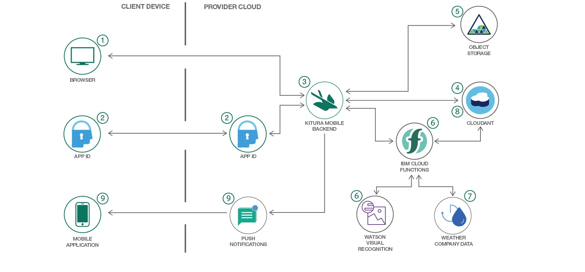

---

copyright:
  years: 2018, 2019
lastupdated: "2019-03-14"

keywords: bluepic swift, ios bluepic, bff swift image, sample swift, swift example bff

subcollection: swift

---

{:new_window: target="_blank"}
{:shortdesc: .shortdesc}
{:screen: .screen}
{:codeblock: .codeblock}
{:pre: .pre}
{:note: .deprecated}

# Caso de uso de lógica de iOS y de nube
{: #sample_cloud}

Un ejemplo de una aplicación de iOS que utiliza un BFF (Backend For Frontend) se puede ver a través de la [aplicación de ejemplo de compartición de imágenes BluePic](https://github.com/IBM/BluePic){: new_window} . La app BluePic utiliza las tecnologías siguientes:

* Almacenamiento de objetos y Cloudant para almacenar los datos de imagen.
* Watson Visual Recognition y el servicio de IBM Weather Company para añadir información adicional a las imágenes.
* Kitura y {{site.data.keyword.openwhisk}} para proporcionar lógica de fondo y autenticación de control y notificaciones push, que se escriben en Swift.

En el ejemplo de BluePic, cuando se publica una imagen, sus datos se registran en Cloudant, y el binario de la imagen se almacena en Object Storage. Desde allí, se invoca una secuencia de {{site.data.keyword.openwhisk_short}} y hace que los datos meteorológicos, como la temperatura y la condición actual (por ejemplo, soleado, nublado), se calculen en función de la ubicación desde donde se ha cargado una imagen. También se utiliza Watson Visual Recognition en la secuencia de {{site.data.keyword.openwhisk_short}} para analizar la imagen y extraer códigos de texto en función del contenido de la imagen. Finalmente, se envía una notificación push al usuario, que le informa de que la imagen se ha procesado, y ahora incluye datos meteorológicos y de etiqueta.
