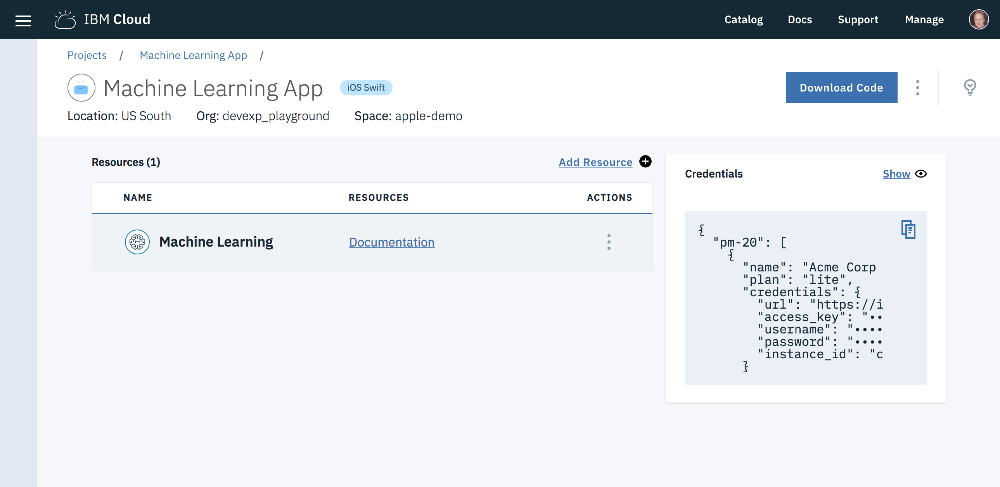

---

copyright:
  years: 2018, 2019
lastupdated: "2019-01-15"

---

{:new_window: target="_blank"}
{:shortdesc: .shortdesc}
{:screen: .screen}
{:codeblock: .codeblock}
{:pre: .pre}
{:tip: .tip}

# Análisis de conjuntos de datos con modelos generados personalizados
{: #dsx-overview}

Watson Studio le proporciona el entorno y las herramientas para resolver sus problemas empresariales mediante el análisis en colaboración de datos. Puede elegir las herramientas que necesita para analizar, limpiar y organizar los datos. Aprenda a ingerir datos en streaming, o a crear, entrenar y desplegar modelos de aprendizaje automático. Watson Studio se integra con un amplio rango de servicios de {{site.data.keyword.cloud}} y Watson Knowledge Catalog, que proporciona gestión de políticas para controlar activos, y catálogos para indexarlos para localizarlos. Obtenga más información en https://dataplatform.ibm.com/.

Watson Studio está estructurado en torno a una arquitectura basada en proyectos, que organiza sus recursos para resolver un problema empresarial. Entre los recursos se incluyen conexiones a la nube y a almacenes de datos locales, archivos de datos, colaboradores y activos analíticos como modelos. Obtenga más información en https://datascience.ibm.com/docs/content/getting-started/overview-ws.html?context=analytics.

## Aprendizaje automático para {{site.data.keyword.DSX}}
{: #dsx-learning}

Al utilizar {{site.data.keyword.DSX}}, es posible entrenar modelos y desplegarlos y luego consumir los resultados utilizando API. A continuación, estas API se pueden utilizar en las aplicaciones de iOS o Swift.

Con IBM Watson Machine Learning, después de configurar el entorno, puede crear modelos, desplegarlos en la nube y entrenarlos. Para obtener más información, consulte [Crear, desplegar y entrenar modelos con {{site.data.keyword.pm_full}} y {{site.data.keyword.DSX}}](https://datascience.ibm.com/docs/content/analyze-data/wml-ai.html?context=analytics).

### Guías de aprendizaje
{: #dsx-tutorials}

- [Crear un modelo de regresión logística con {{site.data.keyword.pm_short}}](https://datascience.ibm.com/docs/content/analyze-data/ml-example-log-regress.html?context=analytics)
- [Crear un modelo bayesiano ingenuo con {{site.data.keyword.pm_short}}](https://datascience.ibm.com/docs/content/analyze-data/ml-example-naive-bayes.html?context=analytics)

## Configuración de {{site.data.keyword.DSX}} con iOS y Swift
{: #dsx_ios}

1. Para facilitar la integración de las credenciales, debe añadir la instancia de {{site.data.keyword.pm_short}} a la app de iOS o a la app de programa de fondo. Para facilitar la accesibilidad, las credenciales se incluyen en el panel de control del proyecto.



2. Descargue el código de la app.
3. Inicialización
  * Para un proyecto de iOS, simplemente añadiendo el recurso {{site.data.keyword.pm_short}} al proyecto de iOS, las credenciales se inyectan de forma instantánea en la app.
    Para acceder a las credenciales desde la aplicación, copie y pegue el siguiente fragmento de código. Además, asegúrese de añadir el punto final de puntuación a la app, que se puede encontrar dentro del separador `implementación` del despliegue del modelo.

    ```swift
    /* URL al punto final de puntuación de su modelo */
    let modelScoringURL: String = "<your-ml-model-scoringUrl>"

    /* Credenciales de usuario */
    var machineLearningUsername: String!
    var machineLearningPassword: String!

    /* Inicialización de aprendizaje automático */
    if let contents = Bundle.main.path(forResource:"BMSCredentials", ofType: "plist"),
       let dictionary = NSDictionary(contentsOfFile: contents),
       let username = dictionary["machinelearningUsername"] as? String,
       let password = dictionary["machinelearningPassword"] as? String {

           machineLearningUsername = username
           machineLearningPassword = password

    }
    ```
    {: codeblock}

  * Para la aplicación del lado del servidor, añada manualmente el nombre de usuario y la contraseña a la aplicación, así como el punto final de puntuación, que se puede encontrar dentro del separador `implementación` del despliegue del modelo.

    ```swift
    /* Sus credenciales de Machine Learning */
    let machineLearningUsername: String = "<your-ml-service-username>"
    let machineLearningPassword: String = "<your-ml-service-password>"

    /* URL al punto final de puntuación de su modelo */
    let modelScoringURL: String = "<your-ml-model-scoringUrl>"
    ```
    {: codeblock}

4. Recupere las señales de acceso y realice un análisis predictivo de los conjuntos de datos de la aplicación con un SDK de cliente simple.

  ```swift
  public class MachineLearning {

      private let username: String
      private let password: String

      public init(username: String, password: String) {
          self.username = username
          self.password = password
      }

      public static func failure(_ error: Error) {
          print("Error:", error.localizedDescription)
      }

      public func retrieveToken(failure: @escaping (Error) -> Void = MachineLearning.failure, success: @escaping (String) -> Void) {

          guard var request = createRequest(url: "https://ibm-watson-ml.mybluemix.net/v3/identity/token") else {
              failure(NSError(domain: "Could not create url", code: 1, userInfo: nil))
              return
          }

          guard let authString = (username + ":" + password).data(using: .utf8)?.base64EncodedString() else {
              failure(NSError(domain: "Could not encode credentials", code: 1, userInfo: nil))
              return
          }

          request.setValue("Basic \(authString)", forHTTPHeaderField: "Authorization")

          execute(request, failure: failure) { dict in

              guard let token = dict["token"] as? String else {
                  failure(NSError(domain: "Invalid Response", code: 1, userInfo: nil))
                  return
              }

              success(token)
          }
      }

      public func retrieveScore(_ scoringUrl: String, token: String, payload: [String: Any], failure: @escaping (Error) -> Void  = failure, success: @escaping ([String: Any]) -> Void) {

          guard let data = try? JSONSerialization.data(withJSONObject: payload, options: .prettyPrinted) else {
              failure(NSError(domain: "Could not encode data", code: 1, userInfo: nil))
              return
          }

          guard var request = createRequest(method: "POST", url: scoringUrl, body: data) else {
              failure(NSError(domain: "Could not create url", code: 1, userInfo: nil))
              return
          }

          request.setValue("Bearer " + token, forHTTPHeaderField: "Authorization")
          request.setValue("application/json", forHTTPHeaderField: "Content-Type")

          execute(request, failure: failure, success: success)
      }

      public func createRequest(method: String = "GET", url: String, body: Data? = nil) -> URLRequest? {
          guard let url = URL(string: url) else {
              return nil
          }
          var req = URLRequest(url: url)
          req.httpMethod = method
          req.httpBody = body
          return req
      }

      private func execute(_ request: URLRequest, failure: @escaping (Error) -> Void, success: @escaping ([String: Any]) -> Void) {
          URLSession.shared.dataTask(with: request) { data, _, error in

              guard let data = data, error == nil else {
                  let error = error ?? NSError(domain: "No data was returned", code: 1, userInfo: nil)
                  failure(error)
                  return
              }

              guard let body = try? JSONSerialization.jsonObject(with: data, options: .allowFragments) as? [String: Any],
                    let dict = body else {
                  failure(NSError(domain: "Could not create dictionary", code: 1, userInfo: nil))
                  return
              }

              guard let resp = response as? HTTPURLResponse , resp.statusCode == 200 else {
                 let msg = (dict["errors"] as? [[String: Any]])?.first?["message"] as? String ?? "An error occurred"
                 let code = (response as? HTTPURLResponse)?.statusCode ?? 1
                 failure(NSError(domain: msg, code: code, userInfo: nil))
                 return
             }

              success(dict)

          }.resume()
      }
  }
  ```
  {: codeblock}

### Ejemplo
{: #dsx-example}

**Nombre del caso de ejemplo:** Predicción de línea de productos

**Descripción del caso de ejemplo:** Una empresa que vende equipamiento para actividades al aire libre crea y despliega un modelo para predecir el interés del cliente en su línea de productos. Su tarea es hacer solicitudes de puntuación en el modelo desplegado.

Una vez que se ha desplegado el modelo, puede realizar un análisis predictivo utilizando el punto final de puntuación.

```swift
// Los datos que desea que se analicen
let examplePayload: [String: Any] = [
    "fields": ["GENDER", "AGE", "MARITAL_STATUS", "PROFESSION"],
    "values": [["M", 23, "Single", "Student"],["M", 55, "Single", "Executive"]]
]

// Sus credenciales del servicio
let machineLearningUsername: String = "<your-ml-service-username>"
let machineLearningPassword: String = "<your-ml-service-password>"

// Su punto final de puntuación
let scoringUrl: String = "<your-model-scoring-url>"

// Definir su cliente
let client = MachineLearning(username: username, password: password)

// Recuperar su señal de acceso y puntuar su carga útil
client.retrieveToken { token in
    client.retrieveScore(scoringUrl, token: token, payload: examplePayload) { dict in
        print(dict)
    }
}
```
{: codeblock}

## Pasos siguientes
{: #dsx_next}

¡Buen trabajo! Ahora puede analizar conjuntos de datos utilizando modelos de aprendizaje automático generados personalizados. Mantenga el ritmo aprendiendo más sobre las características que {{site.data.keyword.pm_short}} tiene que ofrecer en [Experiencia en datos y aprendizaje automático](https://www.ibm.com/analytics/data-science/machine-learning).

### Enlaces relacionados
{: #dsx-related}

* [{{site.data.keyword.pm_short}}](/docs/services/PredictiveModeling/index.html#using-machine-learning-with-data-science-experience)
* [{{site.data.keyword.DSX}}](https://datascience.ibm.com/)
* [Documentación de {{site.data.keyword.DSX}}](https://datascience.ibm.com/docs/content/getting-started/welcome-main.html?context=analytics)
