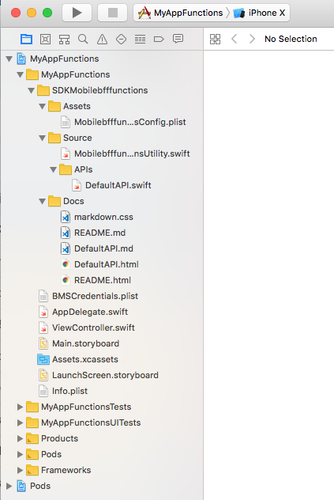

---

copyright:
  years: 2018
lastupdated: "2018-08-17"

---

{:new_window: target="_blank"}
{:shortdesc: .shortdesc}
{:screen: .screen}
{:codeblock: .codeblock}
{:pre: .pre}
{:tip: .tip}

# Ajout d'API aux applis iOS
{: #api_connect}

Vous pouvez utiliser API Connect pour gérer les API dans {{site.data.keyword.cloud}}, que celles-ci soient conservées à l'intérieur ou à l'extérieur d'{{site.data.keyword.cloud_notm}}. Apprenez à gérer vos API afin de pouvoir contrôler l'utilisation, accroître l'adoption et suivre les statistiques.

## Création d'une instance d'API Connect

Accédez au catalogue et créez une instance d'API Connect pour gérer vos API.

Utilisez `Menu->API` pour accéder à la console de gestion API Connect.


Si vous définissez votre propre contrat d'API avant de démarrer le développement de back-end et de front-end, utilisez les outils API Connect pour accélérer ce processus. Vous pouvez travailler avec votre équipe de développement numérique pour générer et définir un contrat d'API entre votre application iOS et votre logique de back-end Cette logique peut être distribuée à l'aide de [{{site.data.keyword.openwhisk}}](/docs/openwhisk/index.html) ou de l'[environnement d'exécution Swift](/docs/runtimes/swift/index.html) avec Kubernetes ou [Cloud Foundry](/docs/cloud-foundry/index.html).

Une fois votre API définie, vous pouvez définir des spécifications d'API ouvertes (Swagger) avec un certain nombre d'outils :

- [Editeur Swagger](http://editor.swagger.io/)
- [Concepteur d'API](https://www.ibm.com/support/knowledgecenter/en/SSFS6T/com.ibm.apic.toolkit.doc/task_apionprem_composing_apis.html)
- [LoopBack](https://loopback.io/)

## Définition de votre API gérée

Vous pouvez définir un proxy d'API qui gère la passerelle d'API entre votre application client et votre logique de back-end. Procédez comme suit pour créer un proxy à l'aide de votre spécification d'API ouverte (document Swagger) YAML ou JSON. 

1. Ouvrez la console `Menu -> API`, puis cliquez sur le proxy d'API.
2. Cliquez sur **API Definition Import YAML or JSON**.
3. Sélectionnez le fichier YAML ou JSON que vous avez préalablement créé.
4. Sauvegardez et exposez.

Vous devez configurer le noeud final externe afin qu'il pointe sur l'URL qui relie à votre application de logique de back-end. 

## Création d'un back-end Swift

Il est possible de créer votre appli Swift de back-end à partir de cette API. 

Depuis la console Apple Development, procédez comme suit :

1. Sélectionnez **Kits de démarrage**.
2. Cliquez sur **Créer une appli**.
3. Sélectionnez **Swift** comme langage.

Sélectionnez le fichier YAML et JSON, puis cliquez sur **Créer**. L'appli Swift de back-end est créée.

Vous pouvez ensuite **télécharger** le Code ou **Déployer sur le Cloud**, puis cloner votre référentiel GIT sur votre machine locale. Pour ouvrir l'application côté serveur dans XCode, suivez les instructions dans le Guide des connaissances.

Dans le dossier **Source**, vous pouvez voir une route qui définit le fichier Swift qui a créé les points finaux REST qui mappent à l'API. 

Voici un exemple qui utilise l'API PetStore Open :
```swift
import Kitura
import KituraContracts

func initializePet_Routes(app: App) {
    app.router.post("\(basePath)/pet") { request, response, next in
        response.send(json: [:])
        next()
    }

    app.router.put("\(basePath)/pet") { request, response, next in
        response.send(json: [:])
        next()
    }

    app.router.get("\(basePath)/pet/findByStatus") { request, response, next in
        response.send(json: [:])
        next()
    }

    app.router.get("\(basePath)/pet/findByTags") { request, response, next in
        response.send(json: [:])
        next()
    }

    app.router.get("\(basePath)/pet/:petId") { request, response, next in
        response.send(json: [:])
        next()
    }

    app.router.post("\(basePath)/pet/:petId") { request, response, next in
        response.send(json: [:])
        next()
    }

    app.router.delete("\(basePath)/pet/:petId") { request, response, next in
        response.send(json: [:])
        next()
    }

    app.router.post("\(basePath)/pet/:petId/uploadImage") { request, response, next in
        response.send(json: [:])
        next()
    }
}
```
{: codeblock}

Une fois l'API définie à l'aide de {{site.data.keyword.openwhisk_short}} ou d'un environnement d'exécution Swift de pile complète, et une fois la définition API Connect créée, vous pouvez consommer l'API dans vos applis iOS.

## Consommation de l'API dans une application mobile iOS

Pour consommer l'API de back-end dans votre appli iOS, créez un kit de démarrage mobile à l'aide de Apple Console. A partir de la vue du kit de démarrage, créez un kit de démarrage iOS de n'importe quel type.

Cliquez sur **Ajouter une ressource** et sélectionnez une API. 


L'API est ajoutée à votre appli iOS. Si vous *téléchargez* le code de l'appli, vous pouvez voir un dossier qui figure dans les dossiers iOS Source et qui est nommé après l'API.

Pour une `mise à jour du pod` des logiciels SDK dépendants dans votre appli iOS, suivez les instructions du Guide des connaissances. 

L'appli iOS comporte un dossier qui contient la liaison de logiciel SDK générée pour cette API. Ce dossier inclut les trois sous-dossiers suivants `Assets`,`Source` et `Docs`. 



Le dossier `Assets` contient le fichier qui gère l'URL de votre API, par défaut `localhost:3000`. Vous devez modifier la valeur qui fait référence à la route d'API. La définition d'API contient une section API Name and Route. Cliquez sur l'**icône de copie** à la fin de la route pour copier l'URL. Vérifiez que l'option *Expose Managed API* est activée afin de permettre aux clients externes d'effectuer des appels d'API.

  

Ouvrez le fichier `PLIST` et remplacez la valeur hôte par la valeur qui est copiée de la route d'API route qui permet au logiciel SDK d'appeler l'API dans {{site.data.keyword.cloud_notm}}.

## Documentation

Une fois le logiciel SDK inclus dans votre projet d'appli iOS, un fichier *README.html* est disponible dans le **dossier Docs**. Ouvrez le dossier Docs dans un navigateur externe et lisez les instructions relatives à l'utilisation de votre projet.

## Recréation du logiciel SDK après une modification d'API

Si l'API est modifiée ou si de nouvelles fonctions deviennent disponibles, et si {{site.data.keyword.openwhisk}} est ajouté, vous pouvez recréer le logiciel SDK client à l'aide de la commande `ibmcloud sdk`. Pour plus d'informations, des exemples et l'aide sur la syntaxe, consultez la documentation [SDK Generator](/docs/cli/sdk/index.html).

Pour activer la création d'un logiciel SDK, utilisez le fichier YAML ou JSON de la spécification d'API ouverte (Swagger). Vous pouvez extraire ce fichier à l'aide des utilitaires de gestion d'API dans l'{{site.data.keyword.cloud_notm}}. 

1. Accédez à `Menu -> API -> API gérées`.
2. Sélectionnez l'API que vous voulez extraire depuis la dernière spécification d'API ouverte. 
3. Ensuite, sélectionnez le menu **Explorateur**.


4. Sélectionnez l'icône de téléchargement afin de télécharger le fichier yaml de l'API et de sauvegarder ce fichier dans votre répertoire de projet d'appli iOS.

5. L'étape suivante consiste à exécuter la commande d'interface CLI `ibmcloud sdk`.
    ```
    ibmcloud sdk generate --ios --unzip --output ./MyAppFunctions -f ./mobile-bff-functions-1.0.0.yaml SDKMyFunctions
    ```
    {: codeblock}

    Le logiciel SDK est recréé dans le répertoire de projet de votre appli iOS afin que vous puissiez poursuivre la gestion de votre API.

## Référence

L'exemple de logiciel SDK suivant est créé pour {{site.data.keyword.openwhisk_short}} à partir du kit de démarrage. Vous pouvez voir chacune des actions et les fragments de code Swift que vous pouvez inclure dans votre appli iOS.

### Méthodes d'API par défaut
 * [`getCreate`](#getCreate)
 * [`getDelete`](#getDelete)
 * [`getDeleteall`](#getDeleteall)
 * [`getRead`](#getRead)
 * [`getReadall`](#getReadall)
 * [`getUpdate`](#getUpdate)

### Utilisation de `getCreate`
{: #getCreate}

```swift
public static func getCreate(completionHandler: @escaping (_ response: Response?, _ error: Error?) -> Void) -> Void
```
{: codeblock}

#### Paramètres de `getCreate`

- **completionHandler** (obligatoire)
    - Closure prend comme arguments `Response?` et `Error?`.

### Authentification avec `getCreate`

Aucune authentification requise

### Exemple avec `getCreate`
```swift
DefaultAPI.getCreate() { (response, error) in
    guard error == nil else {
        print(error!)
        return
    }
    if let status = response?.statusCode {
        switch status {
        case 0:
            print("Default response")
        default:
            print("Response: \(response?.responseText)")
        }
    }
}
```
{: codeblock}

### Utilisation de `getDelete`
{: #getDelete}

```swift
public static func getDelete(completionHandler: @escaping (_ response: Response?, _ error: Error?) -> Void) -> Void
```
{: codeblock}

#### Paramètres de `getDelete`

- **completionHandler** (obligatoire)
    - Closure prend comme arguments `Response?` et `Error?`.

### Authentification avec `getDelete`

Aucune authentification requise

### Exemple avec `getDelete`
```swift
DefaultAPI.getDelete() { (response, error) in
    guard error == nil else {
        print(error!)
        return
    }
    if let status = response?.statusCode {
        switch status {
        case 0:
            print("Default response")
        default:
            print("Response: \(response?.responseText)")
        }
    }
}
```
{: codeblock}

### Utilisation de `getDeleteall`
{: #getDeleteall}

```swift
public static func getDeleteall(completionHandler: @escaping (_ response: Response?, _ error: Error?) -> Void) -> Void
```
{: codeblock}

#### Paramètres de `getDeleteall`

- **completionHandler** (obligatoire)
    - Closure prend comme arguments `Response?` et `Error?`.

### Authentification avec `getDeleteall`

Aucune authentification requise

### Exemple avec `getDeleteall`

```swift
DefaultAPI.getDeleteall() { (response, error) in
    guard error == nil else {
        print(error!)
        return
    }
    if let status = response?.statusCode {
        switch status {
        case 0:
            print("Default response")
        default:
            print("Response: \(response?.responseText)")
        }
    }
}
```
{: codeblock}

### Utilisation de `getRead`
{: #getRead}

```swift
public static func getRead(completionHandler: @escaping (_ response: Response?, _ error: Error?) -> Void) -> Void
```
{: codeblock}

#### Paramètres de `getRead`

- **completionHandler** (obligatoire)
    - Closure prend comme arguments `Response?` et `Error?`.

### Authentification avec `getRead`

Aucune authentification requise

### Exemple avec `getRead`
```swift
DefaultAPI.getRead() { (response, error) in
    guard error == nil else {
        print(error!)
        return
    }
    if let status = response?.statusCode {
        switch status {
        case 0:
            print("Default response")
        default:
            print("Response: \(response?.responseText)")
        }
    }
}
```
{: codeblock}

### Utilisation de `getReadall`
{: #getReadall}

```swift
public static func getReadall(completionHandler: @escaping (_ response: Response?, _ error: Error?) -> Void) -> Void
```
{: codeblock}

#### Paramètres de `getReadall`

- **completionHandler** (obligatoire)
    - Closure prend comme arguments `Response?` et `Error?`.

### Authentification avec `getReadall`

Aucune authentification requise

### Exemple avec `getReadall`
```swift
DefaultAPI.getReadall() { (response, error) in
    guard error == nil else {
        print(error!)
        return
    }
    if let status = response?.statusCode {
        switch status {
        case 0:
            print("Default response")
        default:
            print("Response: \(response?.responseText)")
        }
    }
}
```
{: codeblock}

### Utilisation de `getUpdate`
{: #getUpdate}

```swift
public static func getUpdate(completionHandler: @escaping (_ response: Response?, _ error: Error?) -> Void) -> Void
```
{: codeblock}

#### Paramètres de `getUpdate`

- **completionHandler** (obligatoire)
    - Closure prend comme arguments `Response?` et `Error?`.

### Authentification avec `getUpdate`

Aucune authentification requise

### Exemple avec `getUpdate`
```swift
DefaultAPI.getUpdate() { (response, error) in
    guard error == nil else {
        print(error!)
        return
    }
    if let status = response?.statusCode {
        switch status {
        case 0:
            print("Default response")
        default:
            print("Response: \(response?.responseText)")
        }
    }
}
```
{: codeblock}

