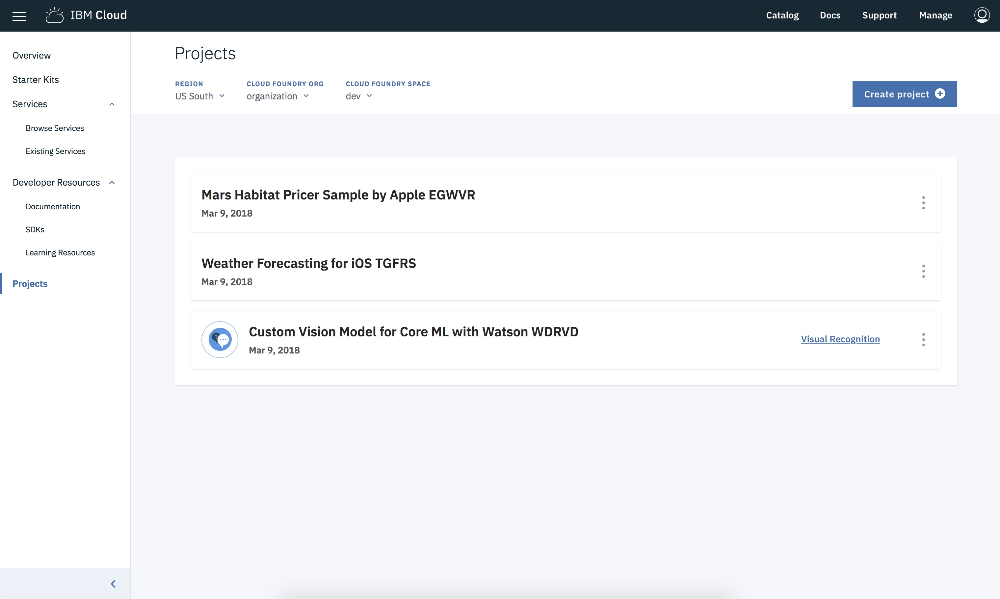

---

copyright:
  years: 2018, 2019
lastupdated: "2019-05-21"

keywords: swift starter kit, apple developer console, download code swift, app details swift, create swift app

subcollection: swift

---

{:new_window: target="_blank"}
{:shortdesc: .shortdesc}
{:screen: .screen}
{:codeblock: .codeblock}
{:pre: .pre}
{:tip: .tip}

# Création d'applications Swift avec les kits de démarrage
{: #starterkits-intro}

La console de développement {{site.data.keyword.cloud_notm}} pour Apple permet aux développeurs de créer des applications à partir des différents kits de démarrage, de mettre à disposition et de connecter les principaux services optimisés {{site.data.keyword.cloud_notm}}, puis de télécharger rapidement le code opérationnel (ou de définir une distribution continue). Les utilisateurs peuvent ainsi créer, consulter, configurer et gérer votre application, mais également télécharger son code. Avec les kits de démarrage, vous pouvez rapidement évaluer et tester les services {{site.data.keyword.cloud_notm}} avec une toute nouvelle application.

Prêt à vous lancer ? Visitez la [console de développement {{site.data.keyword.cloud_notm}} pour Apple](https://cloud.ibm.com/developer/appledevelopment/starter-kits){: new_window}  pour démarrer sans plus attendre.
{: tip}

## Qu'est-ce qu'un kit de démarrage ?
{: #starterkits-what}

Avec {{site.data.keyword.cloud_notm}} Developer Experience, vous pouvez choisir différents kits de démarrage. Les kits de démarrage indiquent à {{site.data.keyword.cloud_notm}} comment assembler de manière dynamique une application de production squelette, dans le langage de votre choix, prête pour le déploiement en cloud. Chaque kit de démarrage intègre un langage, une infrastructure et un modèle pour un cas d'utilisation réel spécifique qui permet la réutilisation du code plutôt que sa réinvention.

Les kits de démarrage sont prêts pour la production et ils sont axés sur la démonstration d'une implémentation de pattern de clé à l'aide d'un environnement d'exécution (Swift, par exemple). Dans certains cas, les kits de démarrage offrent une expérience utilisateur simple ayant pour but de mettre en évidence l'intégration du service. Dans d'autres cas, les kits de démarrage représentent une implémentation personnalisable d'un cas d'utilisation élaboré.

Les kits de démarrage contiennent des instructions permettant à {{site.data.keyword.cloud_notm}} de générer automatiquement des applications avec du code portable et d'indiquer la mise à disposition automatique de ressources lorsque vous créez une application depuis le kit de démarrage.

## Utilisation de la console de développement {{site.data.keyword.cloud_notm}} pour Apple
{: #starterkits-journey}

La console de développement {{site.data.keyword.cloud_notm}} pour Apple propose un processus transparent pour la génération d'une application Starter Swift pour votre cas d'utilisation spécifique. Examinons les étapes que vous pouvez suivre au cours de ce processus.

### Ecran de présentation
{: #overview_screen}

Cet écran offre un contenu qui est adapté à un ensemble de cas d'utilisation tels que Watson, Weather, etc. Depuis l'écran de présentation, vous pouvez accéder à la documentation, aux ressources de formation, parcourir les services, consulter les kits de démarrage en exergue ou encore établir une liaison à une collection kits de démarrage plus large. Sélectionnez **Kits** dans la zone de navigation pour passer à la vue Kits de démarrage.

{: caption="Figure 1. Ecran de présentation de la console de développement {{site.data.keyword.cloud_notm}} pour Apple" caption-side="bottom"}

### Vue des kits de démarrage
{: #starter_kits_view}

La vue des kits de démarrage affiche la collection des kits de démarrage spécifiques à une zone de cas d'utilisation. Vous pouvez cliquer sur les différents liens d'une carte de kit de démarrage pour voir des démonstrations et d'autres informations. Sélectionnez un kit de démarrage pour passer à la vue Créer une application.

{: caption="Figure 2. Vue Kits de démarrage de le console de développement {{site.data.keyword.cloud_notm}} pour Apple" caption-side="bottom"}

### Vue Créer une application
{: #create_new_app_view}

Dans la vue **Créer une application**, vous pouvez nommer votre application, mais également fournir des informations de déploiement et de routage. Vous pouvez également voir les services qui sont automatiquement mis à disposition lorsque vous créez votre application, ainsi que les plans de tarification, et les conditions de chacun. Sélectionnez **Créer** pour accéder à la vue Détails de l'application. Si vous n'êtes pas connecté à {{site.data.keyword.cloud_notm}}, vous devez le faire maintenant.

{: caption="Figure 3. Vue Créer une application de la console de développement {{site.data.keyword.cloud_notm}} pour Apple" caption-side="bottom"}

## Vue Détails de l'application
{: #app_details_view}

Cette vue affiche une liste de tous les services configurés pour votre application. Pour chaque élément de la liste, vous pouvez voir le nom de service, les liens vers d'autres informations, et un bouton **Actions** comportant trois points alignés verticalement. Les options du bouton **Actions** permettent de retirer des services d'une application, d'ouvrir le tableau de bord du service et de supprimer un service. Le retrait d'une instance de service retire l'association à cette application, mais cela ne supprime pas l'instance de service. De plus, les données d'identification du service sont consolidées dans cette vue, de sorte que vous n'avez pas à visiter chaque vue d'instance de service individuelle pour les obtenir.

{: caption="Figure 4. Vue Détails de l'application de la console de développement {{site.data.keyword.cloud_notm}} pour Apple" caption-side="bottom"}

Depuis la page **Détails de l'application**, vous pouvez ajouter des services nouveaux ou existants à votre application qui ne faisaient pas partie du kit de démarrage d'origine. Cliquez sur **Ajout d'un service** pour ajouter des services. Les services disponibles dépendent du type d'application et des services qui sont offerts dans une région, de sorte qu'il n'est pas possible d'associer tous les services à toutes les applications.

{: caption="Figure 5. Boîte de dialogue Ajouter une ressource de la console de développement {{site.data.keyword.cloud_notm}} pour Apple" caption-side="bottom"}

### Téléchargement de votre code

Sur la page _Détails de l'application_, vous pouvez accéder à votre code en sélectionnant **Télécharger le code** pour générer et télécharger le code correspondant à votre application.

### Vue Liste des applications
{: #app_list_view}

Vous pouvez afficher la liste de toutes les applications créées à partir de la vue _Liste des applications_. Vous pouvez renommer ou supprimer vos applications dans cette vue. Cliquez sur la ligne du nom d'une application afin de revenir à la vue Détails de l'application.

{: caption="Figure 6. Vue Liste des applications de la console de développement {{site.data.keyword.cloud_notm}} pour Apple" caption-side="bottom"}

Pour plus d'informations, visitez le site [{{site.data.keyword.cloud_notm}} Developer Console for Apple Learning Resources](https://cloud.ibm.com/developer/appledevelopment/learning-resources){: new_window} .
{: tip}
