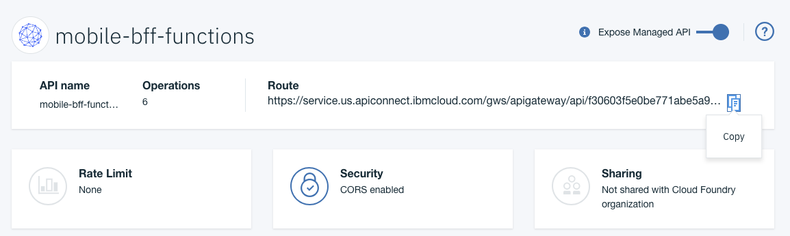

---

copyright:
  years: 2018
lastupdated: "2018-08-17"

---

{:new_window: target="_blank"}
{:shortdesc: .shortdesc}
{:screen: .screen}
{:codeblock: .codeblock}
{:pre: .pre}
{:tip: .tip}

# Aggiunta di API alle applicazioni iOS
{: #api_connect}

Puoi utilizzare API Connect per gestire le API in {{site.data.keyword.cloud}},indipendentemente dal fatto che siano gestite internamente o esternamente a {{site.data.keyword.cloud_notm}}. Impara a gestire le tue API in modo da poter controllare l'utilizzo, aumentare l'adozione e tracciare le statistiche.

## Creazione di un'istanza di API Connect

Vai al catalogo e crea un'istanza di API Connect per gestire le tue API.

Utilizza `Menu->APIs` per accedere alla console API Connect Management.


Se stai definendo un tuo contratto API, prima di iniziare lo sviluppo backend e front-end, utilizza gli strumenti API Connect per accelerare questo processo. Puoi lavorare con il tuo team di sviluppo digitale per creare e definire un contratto di API tra la tua applicazione iOS e la tua logica di backend. Questa logica può essere fornita utilizzando [{{site.data.keyword.openwhisk}}](/docs/openwhisk/index.html) oppure tramite il [runtime Swift](/docs/runtimes/swift/index.html) con Kubernetes o [Cloud Foundry](/docs/cloud-foundry/index.html).

Una volta definita la tua API, puoi definire le specifiche Open API (Swagger) in diversi strumenti:

- [Swagger Editor](http://editor.swagger.io/)
- [API Designer](https://www.ibm.com/support/knowledgecenter/en/SSFS6T/com.ibm.apic.toolkit.doc/task_apionprem_composing_apis.html)
- [Loopback](https://loopback.io/)

## Definizione della tua API gestita

Puoi definire un proxy API che gestisce il gateway API tra la tua applicazione client e la tua logica di backend. Utilizza la seguente procedura per creare un proxy utilizzando la specifica Open API (documento Swagger) YAML o JSON. 

1. Apri la console `Menu -> APIs` e fai clic su API Proxy.
2. Fai clic su **API Definition Import YAML or JSON**.
3. Seleziona il file YAML o JSON che hai creato precedentemente.
4. Salva (Save) ed esponi (Expose).

Devi configurare l'endpoint esterno che punta all'URL che si collega alla tua applicazione di logica di backend. 

## Creazione di un backend Swift

È possibile creare la tua applicazione Swift di backend in base a questa API. 

Dalla console Apple Development, esegui questa procedura:

1. Seleziona **Kit starter**.
2. Fai clic su **Crea applicazione**.
3. Seleziona **Swift** come linguaggio.

Seleziona il file YAML e JSON e fai quindi clic su **Crea**. Viene creata l'applicazione Swift di backend.

Puoi quindi scaricare (**Download**) il codice o eseguire la distribuzione al cloud (**Deploy to Cloud**) e clonare il tuo repository GIT sulla tua macchina locale. Puoi attenerti alle istruzioni nella Knowledge Guide per aprire l'applicazione lato server in XCode.

Nella cartella **Source**, puoi vedere un instradamento che definisce il file Swift che ha creato gli endpoint REST che eseguono l'associazione all'API. 

Vedi il seguente esempio che utilizza la Open API PetStore:
```swift
import Kitura
import KituraContracts

func initializePet_Routes(app: App) {
    app.router.post("\(basePath)/pet") { request, response, next in
        response.send(json: [:])
        next()
    }

    app.router.put("\(basePath)/pet") { request, response, next in
        response.send(json: [:])
        next()
    }

    app.router.get("\(basePath)/pet/findByStatus") { request, response, next in
        response.send(json: [:])
        next()
    }

    app.router.get("\(basePath)/pet/findByTags") { request, response, next in
        response.send(json: [:])
        next()
    }

    app.router.get("\(basePath)/pet/:petId") { request, response, next in
        response.send(json: [:])
        next()
    }

    app.router.post("\(basePath)/pet/:petId") { request, response, next in
        response.send(json: [:])
        next()
    }

    app.router.delete("\(basePath)/pet/:petId") { request, response, next in
        response.send(json: [:])
        next()
    }

    app.router.post("\(basePath)/pet/:petId/uploadImage") { request, response, next in
        response.send(json: [:])
        next()
    }
}
```
{: codeblock}

Una volta definita l'API utilizzando {{site.data.keyword.openwhisk_short}} o un runtime Swift full-stack, e una volta creata la definizione API Connect, puoi utilizzare l'API nelle tue applicazioni iOS.

## Utilizzo dell'API in un'applicazione mobile dell'applicazione iOS

Per utilizzare l'API backend nella tua applicazione iOS, crea un kit starter Mobile utilizzando la Apple Console. Utilizzando la vista Kit starter, crea un kit starter iOS Swift di qualsiasi tipo.

Fai clic su **Add Resource** e seleziona un'API. 


L'API viene aggiunta alla tua applicazione iOS. Se scarichi (*Download*) il codice per l'applicazione, puoi vedere una cartella inclusa nelle cartelle di origine iOS il cui nome deriva dall'API.

Attieniti alla procedura della Knowledge Guide per l'aggiornamento del pod (`pod update`) di qualsiasi SDK dipendente nella tua applicazione iOS. 

L'applicazione iOS include una cartella che contiene il bind SDK generato per l'API. La cartella include le seguenti tre sottocartelle: `Assets`,`Source` e `Docs`. 


La cartella `Assets` contiene il file che gestisce l'URL alla tua API, che per impostazione predefinita è `localhost:3000`. Devi modificare il valore per fare riferimento all'instradamento API.La definizione dell'API contiene le sezioni API Name e Route. Fai clic sull'**icona Copy** alla fine dell'instradamento per copiare l'URL. Controlla che l'opzione *Expose Managed API* sia attivata per abilitare i client esterni ad effettuare chiamate API.

  

Apri il file `PLIST` e sostituisci il valore host con il valore copiato dall'instradamento API che abilita l'SDK a richiamare l'API in {{site.data.keyword.cloud_notm}}.

## Documentazione

Quando l'SDK è incluso nel tuo progetto di applicazione iOS, un file *README.html* è disponibile nella **cartella Docs**. Apri la cartella Docs in un browser esterno e leggi le istruzioni su come utilizzare il tuo progetto.

## Ricreazione dell'SDK dopo la modifica API

Se l'API subisce delle modifiche o se diventano disponibili delle nuove funzioni, e viene aggiunto {{site.data.keyword.openwhisk}}, puoi ricreare l'SDK client utilizzando il comando `ibmcloud sdk`. Per ulteriori informazioni, esempi e guida alla sintassi, controlla la documentazione di [SDK Generator](/docs/cli/sdk/index.html).

Per abilitare la creazione di un SDK, utilizzare il file YAML o JSON di specifica Open API (Swagger). Puoi richiamare questo file utilizzando le funzioni di gestione API in {{site.data.keyword.cloud_notm}}. 

1. Vai a `Menu -> APIs -> Managed APIs`.
2. Seleziona l'API da cui vuoi richiamare la specifica Open API più recente. 
3. Seleziona quindi il menu **Explorer**.


4. Seleziona l'icona di download per scaricare lo yaml per l'API e salva questo file nella directory di progetto della tua applicazione iOS.

5. Il passo successivo consiste nell'esecuzione del comando della CLI `ibmcloud sdk`.
    ```
    ibmcloud sdk generate --ios --unzip --output ./MyAppFunctions -f ./mobile-bff-functions-1.0.0.yaml SDKMyFunctions
    ```
    {: codeblock}

    L'SDK viene ricreato nella directory del progetto della tua applicazione iOS in modo da consentirti di continuare a lavorare con la tua API.

## Riferimento

Il seguente SDK di esempio viene creato per {{site.data.keyword.openwhisk_short}} dal kit starter. Puoi vedere ciascuna delle azioni e i frammenti di codice Swift che puoi includere nella tua applicazione iOS:

### Metodi API predefiniti
 * [`getCreate`](#getCreate)
 * [`getDelete`](#getDelete)
 * [`getDeleteall`](#getDeleteall)
 * [`getRead`](#getRead)
 * [`getReadall`](#getReadall)
 * [`getUpdate`](#getUpdate)

### Utilizzo di `getCreate`
{: #getCreate}

```swift
public static func getCreate(completionHandler: @escaping (_ response: Response?, _ error: Error?) -> Void) -> Void
```
{: codeblock}

#### Parametri per `getCreate`

- **completionHandler** (obbligatorio)
    - La chiusura accetta come argomenti `Response?` ed `Error?`.

### Autenticazione con `getCreate`

Non è richiesta alcuna autenticazione

### Esempio che utilizza `getCreate`
```swift
DefaultAPI.getCreate() { (response, error) in
    guard error == nil else {
        print(error!)
        return
    }
    if let status = response?.statusCode {
        switch status {
        case 0:
            print("Default response")
        default:
            print("Response: \(response?.responseText)")
        }
    }
}
```
{: codeblock}

### Utilizzo di `getDelete`
{: #getDelete}

```swift
public static func getDelete(completionHandler: @escaping (_ response: Response?, _ error: Error?) -> Void) -> Void
```
{: codeblock}

#### Parametri per `getDelete`

- **completionHandler** (obbligatorio)
    - La chiusura accetta come argomenti `Response?` ed `Error?`.

### Autenticazione con `getDelete`

Non è richiesta alcuna autenticazione

### Esempio che utilizza `getDelete`
```swift
DefaultAPI.getDelete() { (response, error) in
    guard error == nil else {
        print(error!)
        return
    }
    if let status = response?.statusCode {
        switch status {
        case 0:
            print("Default response")
        default:
            print("Response: \(response?.responseText)")
        }
    }
}
```
{: codeblock}

### Utilizzo di `getDeleteall`
{: #getDeleteall}

```swift
public static func getDeleteall(completionHandler: @escaping (_ response: Response?, _ error: Error?) -> Void) -> Void
```
{: codeblock}

#### Parametri per `getDeleteall`

- **completionHandler** (obbligatorio)
    - La chiusura accetta come argomenti `Response?` ed `Error?`.

### Autenticazione con `getDeleteall`

Non è richiesta alcuna autenticazione

### Esempio che utilizza `getDeleteall`

```swift
DefaultAPI.getDeleteall() { (response, error) in
    guard error == nil else {
        print(error!)
        return
    }
    if let status = response?.statusCode {
        switch status {
        case 0:
            print("Default response")
        default:
            print("Response: \(response?.responseText)")
        }
    }
}
```
{: codeblock}

### Utilizzo di `getRead`
{: #getRead}

```swift
public static func getRead(completionHandler: @escaping (_ response: Response?, _ error: Error?) -> Void) -> Void
```
{: codeblock}

#### Parametri per `getRead`

- **completionHandler** (obbligatorio)
    - La chiusura accetta come argomenti `Response?` ed `Error?`.

### Autenticazione con `getRead`

Non è richiesta alcuna autenticazione

### Esempio che utilizza `getRead`
```swift
DefaultAPI.getRead() { (response, error) in
    guard error == nil else {
        print(error!)
        return
    }
    if let status = response?.statusCode {
        switch status {
        case 0:
            print("Default response")
        default:
            print("Response: \(response?.responseText)")
        }
    }
}
```
{: codeblock}

### Utilizzo di `getReadall`
{: #getReadall}

```swift
public static func getReadall(completionHandler: @escaping (_ response: Response?, _ error: Error?) -> Void) -> Void
```
{: codeblock}

#### Parametri per `getReadall`

- **completionHandler** (obbligatorio)
    - La chiusura accetta come argomenti `Response?` ed `Error?`.

### Autenticazione con `getReadall`

Non è richiesta alcuna autenticazione

### Esempio che utilizza `getReadall`
```swift
DefaultAPI.getReadall() { (response, error) in
    guard error == nil else {
        print(error!)
        return
    }
    if let status = response?.statusCode {
        switch status {
        case 0:
            print("Default response")
        default:
            print("Response: \(response?.responseText)")
        }
    }
}
```
{: codeblock}

### Utilizzo di `getUpdate`
{: #getUpdate}

```swift
public static func getUpdate(completionHandler: @escaping (_ response: Response?, _ error: Error?) -> Void) -> Void
```
{: codeblock}

#### Parametri per `getUpdate`

- **completionHandler** (obbligatorio)
    - La chiusura accetta come argomenti `Response?` ed `Error?`.

### Autenticazione con `getUpdate`

Non è richiesta alcuna autenticazione

### Esempio che utilizza `getUpdate`
```swift
DefaultAPI.getUpdate() { (response, error) in
    guard error == nil else {
        print(error!)
        return
    }
    if let status = response?.statusCode {
        switch status {
        case 0:
            print("Default response")
        default:
            print("Response: \(response?.responseText)")
        }
    }
}
```
{: codeblock}

