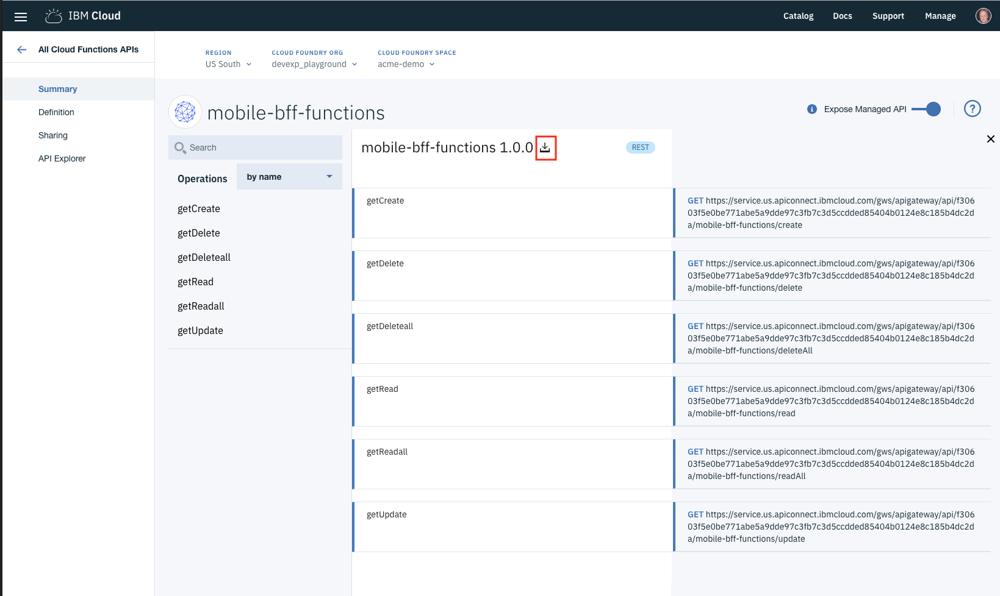

---

copyright:
  years: 2018, 2019
lastupdated: "2019-03-14"

keywords: swift api connect, swagger swift, open api swift, api designer, loopback swift api, create swift backend, swift api parameters, swift api reference

subcollection: swift

---

{:new_window: target="_blank"}
{:shortdesc: .shortdesc}
{:screen: .screen}
{:codeblock: .codeblock}
{:pre: .pre}
{:tip: .tip}

# iOS アプリへの API の追加
{: #api_connect}

API Connect を使用すると、{{site.data.keyword.cloud_notm}} で維持されているかどうかに関係なく、{{site.data.keyword.cloud}} で API を管理できます。 使用の制御、採用の増加、統計のトラッキングを行えるよう API を管理する方法について説明します。

## API Connect インスタンスの作成
{: #create-apiconnect}

「[カタログ](https://cloud.ibm.com/catalog/){: new_window} 」に移動し、API を管理する API Connect インスタンスを作成します。

`「メニュー」->「API」`を使用して、API Connect 管理コンソールにアクセスします。


バックエンドとフロントエンドの開発を開始する前に独自の API 契約を定義している場合、API Connect ツールを使用してこのプロセスを加速させます。 デジタル開発チームと連携して、iOS アプリとバックエンド・ロジック間での API 契約を作成および定義します。 このロジックは、[{{site.data.keyword.openwhisk}}](/docs/openwhisk?topic=cloud-functions-index#index)、[Swift ランタイム](/docs/runtimes/swift?topic=Swift-swift_runtime#swift_runtime) (Kubernetes を使用)、[Cloud Foundry](/docs/cloud-foundry?topic=cloud-foundry-about#about) のいずれかを使用して配信できます。

API を定義すると、次のような様々なツールで Open API 仕様 (Swagger) を定義できます。

- [Swagger Editor](http://editor.swagger.io/){: new_window} 
- [API Designer](https://www.ibm.com/support/knowledgecenter/en/SSFS6T/com.ibm.apic.toolkit.doc/task_apionprem_composing_apis.html){: new_window} 
- [Loopback](https://loopback.io/){: new_window} 

## 管理 API の定義
{: #define-apiconnect}

クライアント・アプリケーションとバックエンド・ロジック間の API ゲートウェイを管理する API プロキシーを定義できます。 以下のステップを使用して、Open API 仕様 (Swagger ドキュメント) の YAML または JSON を用いてプロキシーを作成します。 

1. `「メニュー」->「API」`コンソールを開き、API プロキシーをクリックします。
2. **「YAML または JSON の API 定義インポート (API Definition Import YAML or JSON)」**をクリックします。
3. 作成してある YAML ファイルまたは JSON ファイルを選択します。
4. 保存して公開します。

バックエンド・ロジック・アプリケーションにリンクする URL を指すように外部エンドポイントを構成する必要があります。 

## Swift バックエンドの作成
{: #create-backend-apiconnect}

この API に基づいてバックエンド Swift アプリを作成することができます。 

[「Apple 開発」コンソール](https://cloud.ibm.com/developer/appledevelopment/dashboard){: new_window} で、以下のステップを実行します。

1. **「スターター・キット」**を選択します。
2. **「アプリの作成」**をクリックします。
3. 言語として**「Swift」**を選択します。

YAML ファイルと JSON ファイルを選択し、**「作成」**をクリックします。 バックエンド Swift アプリが作成されます。

次に、コードを**ダウンロード**するか、**デプロイ**し、GIT リポジトリーをローカル・マシンに複製できます。 Knowledge Guide の指示に従って、Xcode でサーバー・サイド・アプリを開きます。

**Source** フォルダーで、API にマップする REST エンドポイントを作成した Swift ファイルを定義する経路を確認できます。 

`PetStore` Open API を使用する次の例をご覧ください。
```swift
import Kitura
import KituraContracts

func initializePet_Routes(app: App) {
    app.router.post("\(basePath)/pet") { request, response, next in
        response.send(json: [:])
        next()
    }

    app.router.put("\(basePath)/pet") { request, response, next in
        response.send(json: [:])
        next()
    }

    app.router.get("\(basePath)/pet/findByStatus") { request, response, next in
        response.send(json: [:])
        next()
    }

    app.router.get("\(basePath)/pet/findByTags") { request, response, next in
        response.send(json: [:])
        next()
    }

    app.router.get("\(basePath)/pet/:petId") { request, response, next in
        response.send(json: [:])
        next()
    }

    app.router.post("\(basePath)/pet/:petId") { request, response, next in
        response.send(json: [:])
        next()
    }

    app.router.delete("\(basePath)/pet/:petId") { request, response, next in
        response.send(json: [:])
        next()
    }

    app.router.post("\(basePath)/pet/:petId/uploadImage") { request, response, next in
        response.send(json: [:])
        next()
    }
}
```
{: codeblock}

{{site.data.keyword.openwhisk_short}} またはフル・スタック Swift ランタイムを使用して API を定義し、API Connect 定義を作成すると、iOS アプリで API を使用できます。

## iOS モバイル・アプリにおける API の使用
{: #consume-apiconnect}

iOS アプリでバックエンド API を使用するには、Apple コンソールを使用してモバイル・スターター・キットを作成します。 「スターター・キット (Starter Kit)」ビューを使用して、任意のタイプの iOS Swift スターター・キットを作成します。

**「サービスの追加」**をクリックし、API を選択します。 


API が iOS アプリに追加されます。 アプリのコードを*ダウンロード*すると、API にちなんだ名前のフォルダーが iOS Soruce フォルダーに含まれているのを確認できます。

Knowledge Guide に記載されているステップに従って、従属 SDK に対して iOS アプリへの `pod update` を実行します。 

iOS アプリには、API 用に生成された SDK バインディングが含まれるフォルダーがあります。 このフォルダーには、`Assets`、`Source`、`Docs` という 3 つのサブフォルダーが含まれます。 


`Assets` フォルダーには、API への URL (デフォルトでは `localhost:3000`) を管理するファイルが含まれます。 API 経路を参照するようにこの値を変更する必要があります。 API 定義は、「API 名」と「経路」のセクションで構成されています。 URL をコピーする経路の末尾にある**「コピー」**をクリックします。 *「管理対象 API の公開」*オプションがオンで、外部クライアントが API 呼び出しを行えることを確認します。

  

`PLIST` ファイルを開き、ホスト値を、API 経路からコピーした値に置き換えます。この値によって、SDK は {{site.data.keyword.cloud_notm}} へ API を呼び出せるようになります。

## 文書
{: #docs-apiconnect}

SDK が iOS アプリ・プロジェクトに含まれると、*README.html* ファイルを `Docs` フォルダーで利用できるようになります。 外部ブラウザーで `Docs` フォルダーを開き、プロジェクトの使用法に関する指示を参照します。

## API 変更後の SDK の再作成
{: #change-apiconnect}

API 変更または新しいフィーチャーが利用できるようになる場合、{{site.data.keyword.openwhisk}} が追加されると、`ibmcloud sdk` コマンドを使用してクライアント SDK を再作成できます。 詳細情報、例、構文に関するヘルプについては、[SDK Generator](/docs/cli/sdk?topic=cloud-cli-sdk-cli#sdk-cli) の資料を確認してください。

SDK を作成できるようにするには、Open API 仕様 (Swagger) の YAML ファイルまたは JSON ファイルを使用します。 このファイルは、{{site.data.keyword.cloud_notm}} の API 管理機能を使用して取得できます。 

1. `「メニュー」->「API」->「管理 API」`と移動します。
2. 最新の Open API 仕様を取得する API を選択します。 
3. 次に、**「エクスプローラー (Explorer)」**メニューを選択します。



4. 「ダウンロード」アイコンを選択し、API の yaml をダウンロードして iOS アプリ・プロジェクト・ディレクトリーにこのファイルを保存します。

5. 次のステップでは、`ibmcloud sdk` CLI コマンドを実行します。 
    ```
    ibmcloud sdk generate --ios --unzip --output ./MyAppFunctions -f ./mobile-bff-functions-1.0.0.yaml SDKMyFunctions
    ```
    {: codeblock}

    SDK が iOS アプリ・プロジェクト・ディレクトリーに再作成され、API を引き続き扱えます。

## リファレンス
{: #reference-apiconnect}

次の SDK 例は、スターター・キットを使用して {{site.data.keyword.openwhisk_short}} 用に作成されています。 iOS アプリに含めることができるそれぞれのアクションとコードの Swift スニペットを確認できます。

### デフォルトの API メソッド
{: #default-methods-apiconnect}

 * [`getCreate`](#getCreate)
 * [`getDelete`](#getDelete)
 * [`getDeleteall`](#getDeleteall)
 * [`getRead`](#getRead)
 * [`getReadall`](#getReadall)
 * [`getUpdate`](#getUpdate)

### `getCreate` の使用
{: #getcreate-apiconnect}

{: #getCreate}

```swift
public static func getCreate(completionHandler: @escaping (_ response: Response?, _ error: Error?) -> Void) -> Void
```
{: codeblock}

#### `getCreate` のパラメーター

- **completionHandler** (必須)
    - クロージャーは引数 `Response?` と `Error?` を取ります。

### `getCreate` での認証
{: #auth-getcreate}

認証は必要ありません

### `getCreate` の使用例
{: #example-getcreate}

```swift
DefaultAPI.getCreate() { (response, error) in
    guard error == nil else {
        print(error!)
        return
    }
    if let status = response?.statusCode {
        switch status {
        case 0:
            print("Default response")
        default:
            print("Response: \(response?.responseText)")
        }
    }
}
```
{: codeblock}

### `getDelete` の使用
{: #getdelete}

```swift
public static func getDelete(completionHandler: @escaping (_ response: Response?, _ error: Error?) -> Void) -> Void
```
{: codeblock}

#### `getDelete` のパラメーター

- **completionHandler** (必須)
    - クロージャーは引数 `Response?` と `Error?` を取ります。

### `getDelete` での認証
{: #auth-getdelete}

認証は必要ありません

### `getDelete` の使用例
{: #example-getdelete}

```swift
DefaultAPI.getDelete() { (response, error) in
    guard error == nil else {
        print(error!)
        return
    }
    if let status = response?.statusCode {
        switch status {
        case 0:
            print("Default response")
        default:
            print("Response: \(response?.responseText)")
        }
    }
}
```
{: codeblock}

### `getDeleteall` の使用
{: #getdeleteall}

```swift
public static func getDeleteall(completionHandler: @escaping (_ response: Response?, _ error: Error?) -> Void) -> Void
```
{: codeblock}

#### `getDeleteall` のパラメーター

- **completionHandler** (必須)
    - クロージャーは引数 `Response?` と `Error?` を取ります。

### `getDeleteall` での認証
{: #auth-getdeleteall}

認証は必要ありません

### `getDeleteall` の使用例
{: #example-getdeleteall}

```swift
DefaultAPI.getDeleteall() { (response, error) in
    guard error == nil else {
        print(error!)
        return
    }
    if let status = response?.statusCode {
        switch status {
        case 0:
            print("Default response")
        default:
            print("Response: \(response?.responseText)")
        }
    }
}
```
{: codeblock}

### `getRead` の使用
{: #getread}

```swift
public static func getRead(completionHandler: @escaping (_ response: Response?, _ error: Error?) -> Void) -> Void
```
{: codeblock}

#### `getRead` のパラメーター

- **completionHandler** (必須)
    - クロージャーは引数 `Response?` と `Error?` を取ります。

### `getRead` での認証
{: #auth-getread}

認証は必要ありません

### `getRead` の使用例
{: #example-getread}

```swift
DefaultAPI.getRead() { (response, error) in
    guard error == nil else {
        print(error!)
        return
    }
    if let status = response?.statusCode {
        switch status {
        case 0:
            print("Default response")
        default:
            print("Response: \(response?.responseText)")
        }
    }
}
```
{: codeblock}

### `getReadall` の使用
{: #getreadall}

```swift
public static func getReadall(completionHandler: @escaping (_ response: Response?, _ error: Error?) -> Void) -> Void
```
{: codeblock}

#### `getReadall` のパラメーター

- **completionHandler** (必須)
    - クロージャーは引数 `Response?` と `Error?` を取ります。

### `getReadall` での認証
{: #auth-getreadall}

認証は必要ありません

### `getReadall` の使用例
{: #example-getreadall}

```swift
DefaultAPI.getReadall() { (response, error) in
    guard error == nil else {
        print(error!)
        return
    }
    if let status = response?.statusCode {
        switch status {
        case 0:
            print("Default response")
        default:
            print("Response: \(response?.responseText)")
        }
    }
}
```
{: codeblock}

### `getUpdate` の使用
{: #getupdate}

```swift
public static func getUpdate(completionHandler: @escaping (_ response: Response?, _ error: Error?) -> Void) -> Void
```
{: codeblock}

#### `getUpdate` のパラメーター

- **completionHandler** (必須)
    - クロージャーは引数 `Response?` と `Error?` を取ります。

### `getUpdate` での認証
{: #auth-getupdate}

認証は必要ありません

### `getUpdate` の使用例
{: #example-getupdate}

```swift
DefaultAPI.getUpdate() { (response, error) in
    guard error == nil else {
        print(error!)
        return
    }
    if let status = response?.statusCode {
        switch status {
        case 0:
            print("Default response")
        default:
            print("Response: \(response?.responseText)")
        }
    }
}
```
{: codeblock}

