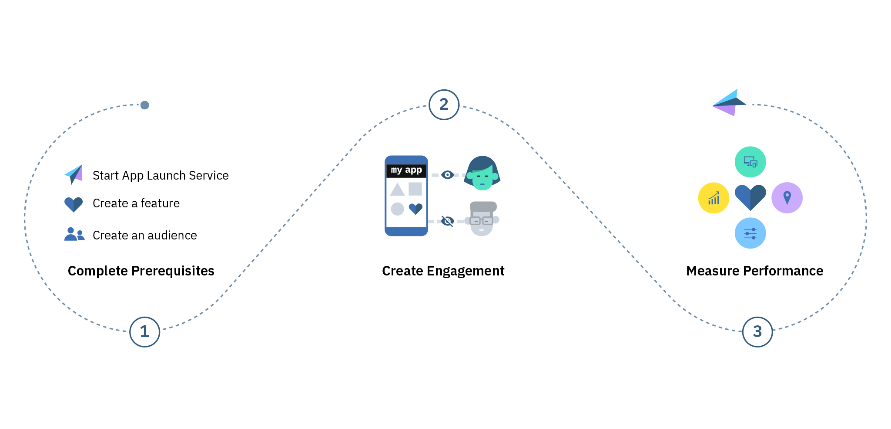
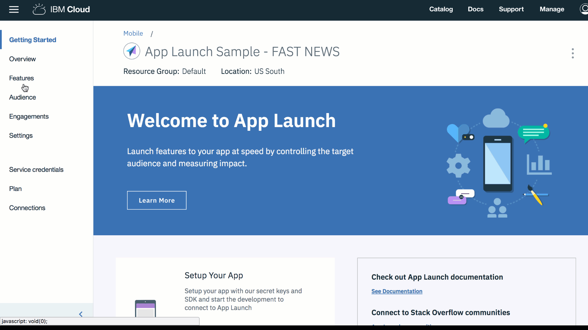

---

copyright:
  years: 2018, 2019
lastupdated: "2019-05-21"

keywords: swift app service, swift versioning, audience swift, messages swift, in-app swift, engagement swift, create feature swift, feature control swift, swift feature release

subcollection: swift

---

{:new_window: target="_blank"}
{:shortdesc: .shortdesc}
{:screen: .screen}
{:codeblock: .codeblock}
{:pre: .pre}
{:gif: data-image-type='gif'}

# 앱 기능 릴리스 관리
{: #mobile_applaunch}

{{site.data.keyword.engage_full}}를 통해 개발자는 측정 가능한 메트릭을 제공할 수 있는 앱 기능의 접근 및 롤아웃을 제어하여 참여 앱(engaging app)을 빌드할 수 있습니다. 서비스는 개발자가 앱 기능 롤아웃과 프로덕션으로의 앱 업데이트 간에 현재 존재하는 결합을 제거하는 데 도움을 줍니다. 이제 기능을 프로덕션에 노출하지 않고 게시하여 제어된 방식으로 앱의 새 버전을 점진적으로 릴리스할 수 있습니다. {{site.data.keyword.engage_short}} 서비스를 사용하여 앱 소유자는 대상으로 지정된 세그먼트에 대한 기능 롤아웃을 전적으로 제어할 수 있습니다.

{{site.data.keyword.engage_short}} 서비스는 기능을 정의하고, 디바이스 플랫폼을 기반으로 잠재고객(audience)을 작성하며(사용자 정의 잠재고객 속성 포함), 최종적으로 기능의 타이밍 및 배치를 구성하는 참여(engagement)를 정의합니다. SDK가 사용된 후 애플리케이션에 포함된 기능 및 메트릭 속성과 함께 서비스는 잠재고객의 경험 측정을 시작합니다. 이제 이 정보를 기반으로 앱을 사용하여 앱 사용자의 여러 카테고리 전체에서 사용자 정의된 고객 참여를 작성할 수 있습니다.

 그림 1. {{site.data.keyword.engage_short}} 서비스 라이프사이클의 개요

다음 {{site.data.keyword.engage_short}} 서비스 기능을 참조하십시오.

- 기능 배치 가속화

  위험을 완화하여 제어된 릴리스를 통해 사용자 앱으로의 기능 전달을 가속화합니다. 기능을 잠재고객 세그먼트의 서브세트로 릴리스하여 실시간 피드백을 기반으로 더 많은 양의 롤아웃 또는 롤백 결정을 내립니다. 일반 릴리스 주기에서 기능 롤아웃을 분리하십시오.

- 잠재고객 세그먼트화

  인구 통계, 컨텍스트 및 작동 속성을 기반으로 사용자 세그먼트를 정의할 수 있습니다. 또한 전체 사용자 기반의 특정 비율로 기능을 롤아웃할 수도 있습니다. 각 기능 및 클라이언트 측 코드마다 핵심성과지표(KPI)를 정의하여 결과를 측정할 수 있습니다.

- 컨텍스트를 기반으로 애플리케이션 조정

  애플리케이션 동작, 사용자 인터페이스 및 알림을 특정 잠재고객 세그먼트에 맞게 사용자 정의할 수 있습니다. 예를 들어, 사용자 위치를 기반으로 앱의 배경을 변경할 수 있습니다. 이 사용자 개인화로 인해 애플리케이션에 대한 사용자의 참여가 증가합니다.

- A / B 테스트 기능

  실험을 통해 자신감을 얻습니다. 동시에 두 개의 애플리케이션 기능 변형을 롤아웃하여 서로 비교할 수 있습니다. 하드 데이터를 기반으로 결정할 수 있습니다.

- 고객 참여 증가**

  사용자 참여를 촉진합니다. 알림은 모든 애플리케이션 사용자 또는 특정 사용자 세트 및 디바이스를 대상으로 할 수 있습니다. 메시지 스케줄을 정의할 수 있습니다. 사용자 상호작용은 고객 관계에서 중요한 역할을 수행합니다.

## 시작하기 전에
{: #prereqs-applaunch}

먼저, 시작하기 전에 다음 필수 소프트웨어를 갖추었는지 확인하십시오.

 - iOS 10+
 - Xcode 9
 - Swift 3.2 - 4
 - CocoaPods 또는 Carthage

## 1단계. {{site.data.keyword.engage_short}}의 인스턴스 작성
{: ##app_launch_create}

1. {{site.data.keyword.cloud_notm}} 카탈로그에서 **모바일** > **앱 실행**을 클릭하십시오. 서비스 구성 화면이 열립니다.
2. 서비스 인스턴스에 이름을 지정하거나 사전 설정된 이름을 사용하십시오.
3. **작성**을 클릭하십시오.
4. 탐색 분할창에서 **연결**을 클릭하여 앱을 선택하고 서비스에 바인드하십시오. 작성 중에 서비스 인스턴스를 바인드되지 않은 상태로 둔 경우 나중에 서비스 인스턴스를 앱에 바인드할 수 있습니다.

## 2단계. 앱 초기화
{: #initialize-applaunch}

서비스는 플랫폼별 SDK를 제공하여 애플리케이션 개발을 간소화합니다. {{site.data.keyword.cloud_notm}} Mobile Services Swift SDK는 CocoaPods 또는 Carthage로 설치할 수 있습니다.

1. **설정**을 클릭하십시오.
2. [SDK](https://github.com/ibm-bluemix-mobile-services/bms-clientsdk-swift-applaunch)를 설치하십시오. 자세한 정보는 설치 단계 및 기술 개념이 포함된 `README` 파일을 참조하십시오.
3. 구성 키를 복사하여 앱을 초기화하십시오. 앱 시크릿, 앱 GUID 및 클라이언트 시크릿을 사용하여 앱을 구성하고 참여를 작성하십시오.

## 3단계. 기능 작성
{: #create-feature-applaunch}

{{site.data.keyword.engage_short}} 서비스는 기능에 대한 응답을 작성하고 테스트합니다.

{: gif}

기능을 작성하려면 다음 단계를 완료하십시오. 
1. 탐색 분할창에서 **기능** > **새 기능 작성**을 클릭하십시오.
2. 기능 이름 및 설명이 포함된 새 기능 및 메트릭 작성 양식을 업데이트하십시오. 또한 기능 특성을 정의하고 메트릭을 추가하여 참여가 미치는 영향을 측정할 수 있습니다. JSON을 편집하여 여러 특성을 추가하려면 **대량 편집**을 클릭하십시오.
3. **작성**을 클릭하십시오. 이제 새 기능이 기능 패널에 표시됩니다.
4. 기능이 개발되고 나면 이를 사용으로 설정하십시오.
5. 참여로 사용할 기능을 사용으로 설정하려면 작성한 기능을 클릭하십시오.
6. 기능 세부사항 창에서 기능의 업데이트 상태를 **준비**로 선택하십시오.
7. **업데이트 상태**를 클릭하십시오.
8. iOS 앱에 새로 작성된 속성 및 기능 코드를 포함하도록 앱을 업데이트하십시오.
9. 이제 기능을 사용할 수 있습니다.

기능 세부사항 창에서는 클라이언트 애플리케이션에서 기본값을 로드하는 데 사용할 수 있는 JSON 파일로 기능을 내보낼 수 있습니다.

## 4단계. 잠재고객 작성
{: #audience-applaunch}

{: gif}

잠재고객(audience)을 작성하려면 다음 단계를 완료하십시오.

### **잠재고객 속성** 작성:
{: #audience-attrib-applaunch}

1. **잠재고객** > **속성 작성**을 클릭하십시오.
2. 다음 값을 제공하십시오.
  * **이름**: 속성에 적합한 이름을 제공합니다.
  * **설명**: 속성에 대한 간략한 설명입니다.
  * **유형**: 속성 유형을 선택합니다.
  * **허용된 값**: 사용할 속성 값을 입력합니다.

  다음 이미지에 나열된 대로 사용자의 요구사항에 따라 둘 이상의 잠재고객 속성을 작성하도록 선택할 수 있습니다.

### **잠재고객** 작성:
{: #audience-create-applaunch}

1. **잠재고객 작성**을 클릭하십시오.
2. 새 잠재고객 창에 적절한 이름 및 설명을 제공하십시오.
3. 속성을 선택하고 **추가**를 클릭하십시오.
4. 나열된 속성에서 필요한 옵션을 선택하십시오.
5. **저장**을 클릭하십시오.

이제 참여를 작성할 수 있습니다.

## 5단계. 참여 작성
{: #engagement-applaunch}

참여(engagement)는 초기화된 특성이 포함된 기능을 인스턴스화하고 사전 정의된 잠재고객 중 한 명을 연결하는 것입니다. **기능 제어** 또는 **인 앱 메시징**을 사용하여 참여를 작성할 수 있습니다.

### 기능 제어(Feature Control) 기능 사용
{: #feature-control-applaunch}

이 참여를 통해 앱 소유자는 런타임 시 기능의 가시성을 사용 또는 사용 안함으로 설정하여 이를 제어할 수 있습니다. 기능은 모든 애플리케이션 사용자 또는 특정 세트의 사용자 및 디바이스에 대해 사용 또는 사용 안함으로 설정할 수 있습니다.

시작 또는 종료 시간 및 날짜를 정의하여 기능 롤아웃을 스케줄하고 조정할 수 있습니다. 또한 정의된 기능을 사용 또는 사용 안함으로 설정하는 특정 날짜도 선택할 수 있습니다.

{: gif}

기능 제어를 사용하여 참여를 작성하려면 다음 단계를 완료하십시오.

1. 다음 방법 중 하나를 사용하여 참여를 작성할 수 있습니다.
  - 탐색 분할창에서 **참여**를 클릭하십시오.
  - 작성한 새 기능에 대해 **참여 작성**을 선택하십시오.
  - 탐색 분할창에서 **개요** > **새 참여 작성**을 클릭하십시오.

  새 참여 창이 표시됩니다.

2. 새 참여에 이름 및 설명을 제공하십시오. 고유한 참여 이름을 제공했으며 참여 이름이 참여에 아직 나열되어 있지 않은지 확인하십시오.
  - **기능 제어**로 **참여 유형을 선택**하십시오.
  - 둘 이상의 기능을 변형하여 제어된 실험을 수행하려면 **실험 유형 선택**에서 **A/B 테스팅**을 선택하십시오. **다음**을 클릭하십시오.

3. 작성한 기능을 선택하십시오. 또한 실험할 변형을 추가하고 정의하도록 선택할 수도 있습니다. **다음**을 클릭하십시오.

4. 잠재고객을 선택하십시오. **다음**을 클릭하십시오.

5. 시간 및 **시작** 날짜 또는 시간 및 **종료** 날짜 또는 시간을 선택하여 트리거를 정의하십시오. **저장**을 클릭하십시오.

  이제 새 참여가 참여 세부사항 창에 표시됩니다.

이제 참여의 [성능](/docs/services/app-launch?topic=app-launch-applaunch_type#applaunch_type)을 측정할 수 있습니다.

### 인 앱 메시징(In-App Messaging) 기능 사용
{: #app-message-applaunch}

이 참여를 통해 앱 사용자가 애플리케이션을 능동적으로 사용하는 동안 앱 소유자는 알림을 앱 사용자에게 전송할 수 있습니다.

메시지는 모든 애플리케이션 사용자 또는 특정 세트의 사용자 및 디바이스를 대상으로 할 수 있습니다. 서비스에 제출할 수 있는 모든 메시지에 대해 의도된 잠재고객이 알림을 수신합니다.

시작 또는 종료 날짜 및 시간을 정의하여 인 앱 메시지를 스케줄할 수 있습니다. 또한 이벤트를 기반으로도 스케줄할 수 있습니다. 이러한 메시지는 사용자의 선택사항, 상호작용, 디바이스, 애플리케이션 로그 등에 대한 분석 인사이트를 기반으로 하므로 좀 더 사용자 정의됩니다.

다음 인 앱 메시지 예제를 참조하십시오.

- 사용자 정의된 메시지를 전송합니다.
- 푸시 알림을 끄도록 사용자에게 메시지를 전송합니다.
- 대화 중에 피드백을 요청하거나 사용자를 참여시킵니다.
- 사용자가 찾고 있는 항목을 기반으로 관련 메시지를 전송합니다.
- 적극적이며 충성도가 높은 고객을 참여시킵니다.
- 사용자에게 앱 업데이트(새 기능 실행)를 알립니다.

{: gif}

메시징 옵션을 사용하는 참여를 작성하려면 다음 단계를 완료하십시오.

1. 다음 방법 중 하나를 사용하여 참여를 작성할 수 있습니다.
  - 탐색 분할창에서 **참여**를 클릭하십시오.
  - 작성한 새 기능에 대해 **참여 작성**을 선택하십시오.
  - 탐색 분할창에서 **개요** > **새 참여 작성**을 클릭하십시오.

  새 참여 창이 표시됩니다.

2. 새 참여에 이름 및 설명을 제공하십시오. 고유한 참여 이름을 제공했으며 참여 이름이 참여에 아직 나열되어 있지 않은지 확인하십시오.
  - **인 앱 메시징**으로 **참여 유형을 선택**하십시오.
  - 메시징 기능을 다양하게 변형하여 제어된 실험을 수행하려면 **실험 유형 선택**에서 **A/B 테스팅**을 선택하십시오. **다음**을 클릭하십시오.

3. 메시지 특성을 입력한 후 **다음**을 클릭하십시오.

4. **잠재고객을 선택**하고 도달하려는 잠재고객의 백분율을 선택하십시오. **다음**을 클릭하십시오.

5. **시작/종료 날짜 및 시간**을 선택하여 트리거를 정의하십시오.

6. **이벤트**를 선택하고 **다음**을 클릭하십시오.

7. 측정하려는 메트릭에 요소를 맵핑하십시오. 요소를 선택하고 메트릭 세부사항을 입력하십시오. **저장**을 클릭하십시오.

  이제 새 참여가 참여 세부사항 창에 표시됩니다.

이제 참여의 [성능](/docs/services/app-launch?topic=app-launch-applaunch_type#applaunch_type)을 측정할 수 있습니다.

## 빠른 링크
{: #links-applaunch notoc}

다음 링크를 확인하여 인사이트를 얻고 {{site.data.keyword.engage_short}}의 기능을 이해하십시오.

 - [앱 실행 서비스](https://cloud.ibm.com/catalog/services/app-launch){: new_window}  사용해 보기
 - [블로그 및 비디오](/docs/services/app-launch?topic=app-launch-blogs-and-videos#blogs-and-videos)
 - 자세한 정보는 [App 실행 - 튜토리얼 시작하기](/docs/services/app-launch?topic=app-launch-gettingstartedtemplate#gettingstartedtemplate) 문서를 참조하십시오.
