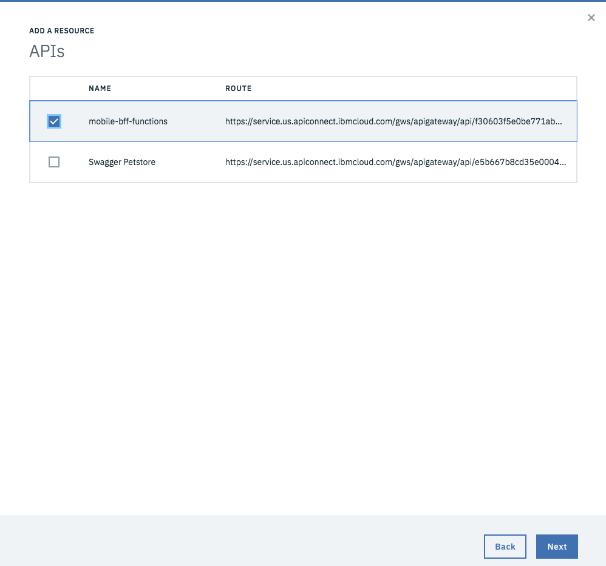

---

copyright:
  years: 2018, 2019
lastupdated: "2019-03-14"

keywords: swift api connect, swagger swift, open api swift, api designer, loopback swift api, create swift backend, swift api parameters, swift api reference

subcollection: swift

---

{:new_window: target="_blank"}
{:shortdesc: .shortdesc}
{:screen: .screen}
{:codeblock: .codeblock}
{:pre: .pre}
{:tip: .tip}

# 向 iOS 应用程序添加 API
{: #api_connect}

您可以使用 API Connect 来管理 {{site.data.keyword.cloud}} 中的 API，不管这些 API 是在 {{site.data.keyword.cloud_notm}} 内部还是外部进行维护。了解如何管理 API，以便您可以控制使用情况，增加采用率和跟踪统计信息。

## 创建 API Connect 的实例
{: #create-apiconnect}

转至[目录](https://cloud.ibm.com/catalog/){: new_window} ，然后创建 API Connect 的实例来管理 API。

使用`菜单 -> API` 来访问 API Connect 管理控制台。


如果要在开始后端和前端开发之前定义自己的 API 合同，请使用 API Connect 工具来快速完成此过程。您可以与数字开发团队合作，在 iOS 应用程序和后端逻辑之间构建并定义 API 合同。此逻辑可以利用 Kubernetes 或 [Cloud Foundry](/docs/cloud-foundry?topic=cloud-foundry-about#about) 通过 [{{site.data.keyword.openwhisk}}](/docs/openwhisk?topic=cloud-functions-index#index) 或 [Swift 运行时](/docs/runtimes/swift?topic=Swift-swift_runtime#swift_runtime)进行传递。

定义 API 后，即可以在多个不同工具中定义“Open API 规范”(Swagger)：

- [Swagger 编辑器](http://editor.swagger.io/){: new_window} 
- [API Designer](https://www.ibm.com/support/knowledgecenter/en/SSFS6T/com.ibm.apic.toolkit.doc/task_apionprem_composing_apis.html){: new_window} 
- [Loopback](https://loopback.io/){: new_window} 

## 定义受管 API
{: #define-apiconnect}

您可以定义用于管理客户端应用程序与后端逻辑之间 API 网关的 API 代理。使用以下步骤可使用“Open API 规范”（Swagger 文档）YAML 或 JSON 来创建代理。 

1. 打开`菜单 -> API` 控制台，然后单击 API 代理。
2. 单击 **API 定义导入 YAML 或 JSON**。
3. 选择先前创建的 YAML 或 JSON 文件。
4. 保存并公开。

您需要配置“外部端点”以指向链接到后端逻辑应用程序的 URL。 

## 创建 Swift 后端
{: #create-backend-apiconnect}

您可以基于此 API 创建后端 Swift 应用程序。 

在 [Apple Development Console](https://cloud.ibm.com/developer/appledevelopment/dashboard){: new_window}  中，执行以下步骤：

1. 选择**入门模板工具包**。
2. 单击**创建应用程序**。
3. 选择 **Swift** 作为语言。

选择 YAML 和 JSON 文件，然后单击**创建**。这将创建后端 Swift 应用程序。

然后，可以**下载**代码或**部署**，并将 GIT 存储库克隆到本地计算机。您可以遵循“理论指导”中的指示信息在 Xcode 中打开服务器端应用程序。

在 **Source** 文件夹中，可以看到一个路径，用于定义创建了映射到 API 的 REST 端点的 Swift 文件。 

请参阅以下示例，其中使用了 `PetStore` Open API：
```swift
import Kitura
import KituraContracts

func initializePet_Routes(app: App) {
    app.router.post("\(basePath)/pet") { request, response, next in
        response.send(json: [:])
        next()
    }

    app.router.put("\(basePath)/pet") { request, response, next in
        response.send(json: [:])
        next()
    }

    app.router.get("\(basePath)/pet/findByStatus") { request, response, next in
        response.send(json: [:])
        next()
    }

    app.router.get("\(basePath)/pet/findByTags") { request, response, next in
        response.send(json: [:])
        next()
    }

    app.router.get("\(basePath)/pet/:petId") { request, response, next in
        response.send(json: [:])
        next()
    }

    app.router.post("\(basePath)/pet/:petId") { request, response, next in
        response.send(json: [:])
        next()
    }

    app.router.delete("\(basePath)/pet/:petId") { request, response, next in
        response.send(json: [:])
        next()
    }

    app.router.post("\(basePath)/pet/:petId/uploadImage") { request, response, next in
        response.send(json: [:])
        next() 
  }
}
```
{: codeblock}

使用 {{site.data.keyword.openwhisk_short}} 或完整堆栈 Swift 运行时定义了 API，并创建了 API Connect 定义后，可以在 iOS 应用程序中使用该 API。

## 在 iOS 应用程序的移动应用程序中使用 API
{: #consume-apiconnect}

要在 iOS 应用程序中使用后端 API，请使用 Apple 控制台来创建移动入门模板工具包。使用“入门模板工具包”视图，创建任何类型的 iOS Swift 入门模板工具包。

单击**添加服务**，然后选择 API。 



API 已添加到 iOS 应用程序。如果*下载*应用程序的代码，那么可以在 iOS 的 Source 文件夹中看到一个以该 API 命名的文件夹。

遵循“理论指导”步骤，对任何从属 SDK 执行 `pod update`，使其更新到 iOS 应用程序中。 

iOS 应用程序包含一个文件夹，其中含有针对 API 生成的 SDK 绑定。此文件夹包含以下三个子文件夹：`Assets`、`Source` 和 `Docs`。 


`Assets` 文件夹包含用于管理 API URL 的文件，缺省情况下为 `localhost:3000`。必须更改该值以引用 API 路径。API 定义由“API 名称”和“路径”两部分组成。单击路径末尾的**复制**来复制 URL。检查是否开启了*公开受管 API* 选项，以允许外部客户端发出 API 调用。

  

打开 `PLIST` 文件，并将主机值替换为从 API 路径复制的值，该值使 SDK 能够将 API 调用到 {{site.data.keyword.cloud_notm}} 中。

## 文档
{: #docs-apiconnect}

如果您的 iOS 应用程序项目包含 SDK，那么可在 `Docs` 文件夹中找到 *README.html* 文件。在外部浏览器中打开 `Docs` 文件夹，然后阅读有关如何使用项目的指示信息。

## 在 API 更改后重新创建 SDK
{: #change-apiconnect}

如果有 API 更改或新的功能可用，并且新增了 {{site.data.keyword.openwhisk}}，那么可以使用 `ibmcloud sdk` 命令来重新创建客户端 SDK。有关更多信息、示例和语法帮助，请查看 [SDK Generator](/docs/cli/sdk?topic=cloud-cli-sdk-cli#sdk-cli) 文档。

要支持创建 SDK，请使用“Open API 规范”(Swagger) YAML 或 JSON 文件。可以使用 {{site.data.keyword.cloud_notm}} 中的 API Management 工具来检索此文件。 

1. 浏览至`菜单 -> API -> 受管 API`。
2. 选择要从中检索最新“Open API 规范”的 API。 
3. 然后，选择**资源管理器**菜单。


4. 选择“下载”图标以下载 API 的 YAML，并将此文件保存在 iOS 应用程序项目目录中。

5. 下一步是运行 `ibmcloud sdk` CLI 命令。
    ```
    ibmcloud sdk generate --ios --unzip --output ./MyAppFunctions -f ./mobile-bff-functions-1.0.0.yaml SDKMyFunctions
    ```
    {: codeblock}

    SDK 已重新创建到 iOS 应用程序项目目录中，现在可以继续使用 API 了。

## 参考
{: #reference-apiconnect}

以下示例 SDK 是通过入门模板工具包针对 {{site.data.keyword.openwhisk_short}} 创建的。您可以查看可在 iOS 应用程序中包含的每个操作和 Swift 代码片段。

### 缺省 API 方法
{: #default-methods-apiconnect}

 * [`getCreate`](#getCreate)
 * [`getDelete`](#getDelete)
 * [`getDeleteall`](#getDeleteall)
 * [`getRead`](#getRead)
 * [`getReadall`](#getReadall)
 * [`getUpdate`](#getUpdate)

### 使用 `getCreate`
{: #getcreate-apiconnect}

{: #getCreate}

```swift
public static func getCreate(completionHandler: @escaping (_ response: Response?, _ error: Error?) -> Void) -> Void
```
{: codeblock}

#### `getCreate` 的参数

- **completionHandler**（必需）
    - 闭包采用自变量 `Response?` 和 `Error?`。

### 使用 `getCreate` 时进行认证
{: #auth-getcreate}

无需认证

### 使用 `getCreate` 的示例
{: #example-getcreate}

```swift
DefaultAPI.getCreate() { (response, error) in
    guard error == nil else {
        print(error!)
        return
    }
    if let status = response?.statusCode {
        switch status {
        case 0:
            print("Default response")
        default:
            print("Response: \(response?.responseText)")
        }
    }
}
```
{: codeblock}

### 使用 `getDelete`
{: #getdelete}

```swift
public static func getDelete(completionHandler: @escaping (_ response: Response?, _ error: Error?) -> Void) -> Void
```
{: codeblock}

#### `getDelete` 的参数

- **completionHandler**（必需）
    - 闭包采用自变量 `Response?` 和 `Error?`。

### 使用 `getDelete` 时进行认证
{: #auth-getdelete}

无需认证

### 使用 `getDelete` 的示例
{: #example-getdelete}

```swift
DefaultAPI.getDelete() { (response, error) in
    guard error == nil else {
        print(error!)
        return
    }
    if let status = response?.statusCode {
        switch status {
        case 0:
            print("Default response")
        default:
            print("Response: \(response?.responseText)")
        }
    }
}
```
{: codeblock}

### 使用 `getDeleteall`
{: #getdeleteall}

```swift
public static func getDeleteall(completionHandler: @escaping (_ response: Response?, _ error: Error?) -> Void) -> Void
```
{: codeblock}

#### `getDeleteall` 的参数

- **completionHandler**（必需）
    - 闭包采用自变量 `Response?` 和 `Error?`。

### 使用 `getDeleteall` 时进行认证
{: #auth-getdeleteall}

无需认证

### 使用 `getDeleteall` 的示例
{: #example-getdeleteall}

```swift
DefaultAPI.getDeleteall() { (response, error) in
    guard error == nil else {
        print(error!)
        return
    }
    if let status = response?.statusCode {
        switch status {
        case 0:
            print("Default response")
        default:
            print("Response: \(response?.responseText)")
        }
    }
}
```
{: codeblock}

### 使用 `getRead`
{: #getread}

```swift
public static func getRead(completionHandler: @escaping (_ response: Response?, _ error: Error?) -> Void) -> Void
```
{: codeblock}

#### `getRead` 的参数

- **completionHandler**（必需）
    - 闭包采用自变量 `Response?` 和 `Error?`。

### 使用 `getRead` 时进行认证
{: #auth-getread}

无需认证

### 使用 `getRead` 的示例
{: #example-getread}

```swift
DefaultAPI.getRead() { (response, error) in
    guard error == nil else {
        print(error!)
        return
    }
    if let status = response?.statusCode {
        switch status {
        case 0:
            print("Default response")
        default:
            print("Response: \(response?.responseText)")
        }
    }
}
```
{: codeblock}

### 使用 `getReadall`
{: #getreadall}

```swift
public static func getReadall(completionHandler: @escaping (_ response: Response?, _ error: Error?) -> Void) -> Void
```
{: codeblock}

#### `getReadall` 的参数

- **completionHandler**（必需）
    - 闭包采用自变量 `Response?` 和 `Error?`。

### 使用 `getReadall` 时进行认证
{: #auth-getreadall}

无需认证

### 使用 `getReadall` 的示例
{: #example-getreadall}

```swift
DefaultAPI.getReadall() { (response, error) in
    guard error == nil else {
        print(error!)
        return
    }
    if let status = response?.statusCode {
        switch status {
        case 0:
            print("Default response")
        default:
            print("Response: \(response?.responseText)")
        }
    }
}
```
{: codeblock}

### 使用 `getUpdate`
{: #getupdate}

```swift
public static func getUpdate(completionHandler: @escaping (_ response: Response?, _ error: Error?) -> Void) -> Void
```
{: codeblock}

#### `getUpdate` 的参数

- **completionHandler**（必需）
    - 闭包采用自变量 `Response?` 和 `Error?`。

### 使用 `getUpdate` 时进行认证
{: #auth-getupdate}

无需认证

### 使用 `getUpdate` 的示例
{: #example-getupdate}

```swift
DefaultAPI.getUpdate() { (response, error) in
    guard error == nil else {
        print(error!)
        return
    }
    if let status = response?.statusCode {
        switch status {
        case 0:
            print("Default response")
        default:
            print("Response: \(response?.responseText)")
        }
    }
}
```
{: codeblock}

