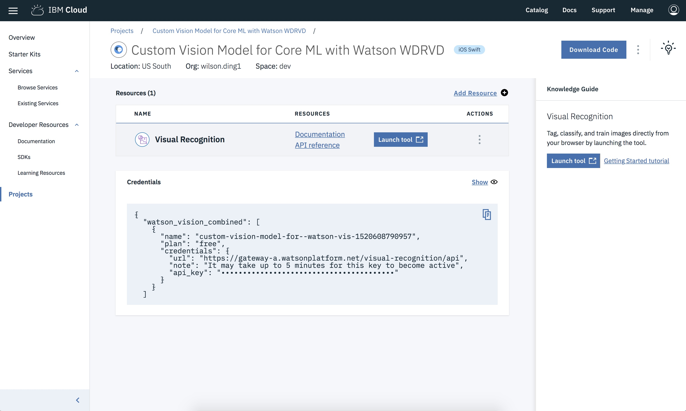

---

copyright:
  years: 2018, 2019
lastupdated: "2019-06-06"

keywords: swift starter kit, apple developer console, download code swift, app details swift, create swift app

subcollection: swift

---

{:new_window: target="_blank"}
{:shortdesc: .shortdesc}
{:screen: .screen}
{:codeblock: .codeblock}
{:pre: .pre}
{:tip: .tip}

# 使用入门模板工具包创建 Swift 应用程序
{: #starterkits-intro}

通过 {{site.data.keyword.cloud_notm}} Developer Console for Apple，Apple 开发者可利用各种入门模板工具包来创建应用程序，供应和连接 {{site.data.keyword.cloud_notm}} 优化的关键服务，然后快速下载可正常运作的代码或设置为持续交付。用户可以创建、查看、配置和管理应用程序，以及下载应用程序的代码。使用入门模板工具包可帮助您使用全新的应用程序快速评估和测试 {{site.data.keyword.cloud_notm}} 服务。

准备好开始了吗？请立即访问 [{{site.data.keyword.cloud_notm}} Developer Console for Apple](https://{DomainName}/developer/appledevelopment/starter-kits){: new_window}  以开始。
{: tip}

## 什么是入门模板工具包？
{: #starterkits-what}

通过 {{site.data.keyword.cloud_notm}} 开发者控制台，可以从各种入门模板工具包中进行选择。入门模板工具包指示 {{site.data.keyword.cloud_notm}} 以您选择的语言动态组合框架生产应用程序，该应用程序可随时进行云部署。每个入门模板工具包都包含语言、框架以及用于特定现实世界用例的模式，该用例允许复用代码，而不用重新创建代码。

入门模板工具包是生产就绪型工具包，专注于使用运行时（例如 Swift）来演示关键模式实现。在某些情况下，初学者工具包会提供简单的用户体验来着重强调服务的集成。在另一些情况下，入门模板工具包是复杂用例的可定制实现。

入门模板工具包中包含的指示信息允许 {{site.data.keyword.cloud_notm}} 使用可移植代码来自动生成搭建有脚手架的应用程序，并可指定在通过入门模板工具包创建应用程序时要自动供应的服务。

## 使用 {{site.data.keyword.cloud_notm}} Developer Console for Apple
{: #starterkits-journey}

{{site.data.keyword.cloud_notm}} Developer Console for Apple 提供了一种无缝的方法，用于针对特定用例构建 Swift 入门模板应用程序。下面我们来看看在此行程中您可能会执行的步骤。

### “概述”屏幕
{: #overview_screen}

“概述”屏幕提供针对一组用例（如 Watson、Weather 等）定制的内容。在“概述”屏幕中，可以查看文档，访问教育资源，浏览服务，查看特色入门模板工具包或链接到更大的入门模板工具包集合。选择导航区域中的**入门模板工具包**可进入“入门模板工具包”视图。

### “入门模板工具包”视图
{: #starter_kits_view}

“入门模板工具包”视图显示特定于用例区域的入门模板工具包的集合。可以单击“入门模板工具包”卡上的各种链接来查看演示和更多信息。选择一个入门模板工具包以移至“创建应用程序”视图。

### “创建应用程序”视图
{: #create_new_app_view}

在**创建应用程序**视图中，可以对应用程序命名以及提供部署和路由信息。您还可以查看在创建应用程序时自动供应的服务，以及价格套餐和每个服务的条款。选择**创建**可移至“应用程序详细信息”视图。如果您未登录到 {{site.data.keyword.cloud_notm}}，那么现在需要登录。

## “应用程序详细信息”视图
{: #app_details_view}

“应用程序详细信息”视图显示已配置用于应用程序的服务的列表。对于列表中的每个项，都可以看到服务名称、其他信息的链接以及具有三个垂直排列的点的**操作**按钮。**操作**按钮选项用于从应用程序中除去服务，打开服务的仪表板以及删除服务。除去服务实例会除去与此应用程序的关联，但不会删除服务实例。此外，服务凭证会在此视图上进行合并，因此不必访问每个单独的服务实例视图来分别获取服务凭证。

通过使用**应用程序详细信息**页面，可以将不属于原始入门模板工具包的新服务或现有服务添加到应用程序。单击**添加服务**以添加服务。可用的服务取决于应用程序的类型以及区域中可用的服务，因此并非所有服务都可用于与所有应用程序相关联。

### 下载代码

要访问您的代码，可以在_应用程序详细信息_页面上选择**下载代码**来生成和下载应用程序的代码。

### 应用程序列表视图
{: #app_list_view}

您可以在_应用程序列表_视图中列出所有已创建的应用程序。可以在此处重命名或删除应用程序。单击应用程序名称行可返回到“应用程序详细信息”视图。

有关更多信息，请访问 [{{site.data.keyword.cloud_notm}} Developer Console for Apple 学习资源](https://{DomainName}/developer/appledevelopment/learning-resources){: new_window} 
{: tip}
