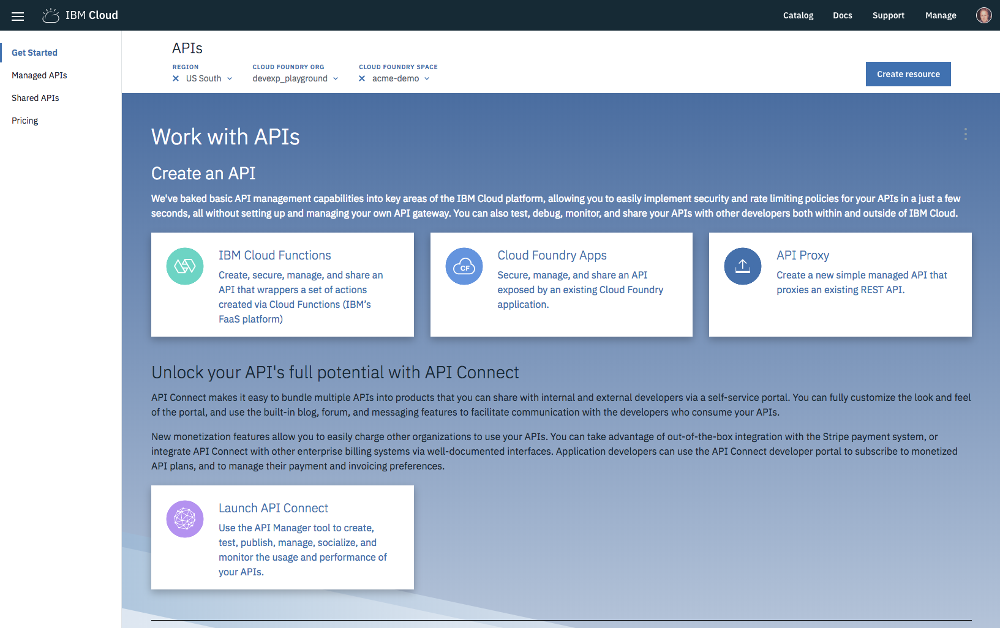

---

copyright:
  years: 2018
lastupdated: "2018-11-12"

---

{:new_window: target="_blank"}
{:shortdesc: .shortdesc}
{:screen: .screen}
{:codeblock: .codeblock}
{:pre: .pre}
{:tip: .tip}

# 新增 API 至 iOS 應用程式
{: #api_connect}

您可以使用 API Connect 來管理 {{site.data.keyword.cloud}} 中的 API，無論 API 是否在 {{site.data.keyword.cloud_notm}} 中進行維護。學習管理您的 API，以控制用量、提高採用率及追蹤統計資料。

## 建立 API Connect 實例

移至[型錄](https://console.bluemix.net/catalog/)，然後建立 API Connect 實例，以管理您的 API。

使用 `Menu->APIs` 來存取「API Connect 管理」主控台。



如果您在開始開發後端與前端系統之前先定義您自己的 API 合約，請使用 API Connect 工具來加速此處理程序。您可以與數位開發團隊合作，以在 iOS 應用程式與後端邏輯之間，建置並定義 API 的合約。使用 [{{site.data.keyword.openwhisk}}](/docs/openwhisk/index.html)，或透過含有 Kubernetes 或 [Cloud Foundry](/docs/cloud-foundry/index.html) 的 [Swift 運行環境](/docs/runtimes/swift/index.html)，即可分送此邏輯。

定義 API 之後，您可以在許多不同的工具中定義 Open API Specifications (Swagger)：

- [Swagger Editor](http://editor.swagger.io/)
- [API Designer](https://www.ibm.com/support/knowledgecenter/en/SSFS6T/com.ibm.apic.toolkit.doc/task_apionprem_composing_apis.html)
- [Loopback](https://loopback.io/)

## 定義受管理 API

您可以定義 API Proxy，以管理用戶端應用程式與後端邏輯之間的 API 閘道。使用下列步驟，利用您的 Open API Specification（Swagger 文件）YAML 或 JSON 來建立 Proxy。 

1. 開啟 `Menu -> APIs` 主控台，然後按一下 API Proxy。
2. 按一下 **API 定義匯入 YAML 或 JSON**。
3. 選取您先前建立的 YAML 或 JSON 檔。
4. 儲存並公開。

您需要配置「外部端點」，以指向鏈結至後端邏輯應用程式的 URL。 

## 建立 Swift 後端

您可以根據此 API 來建立後端 Swift 應用程式。 

從 Apple Development Console，執行下列步驟：

1. 選取**入門範本套件**。
2. 按一下**建立應用程式**。
3. 選取 **Swift** 作為語言。

選取 YAML 及 JSON 檔，然後按一下**建立**。即會建立後端 Swift 應用程式。

然後，您可以**下載**「程式碼」或**部署至 Cloud**，再將 GIT 報告複製到您的本端機器。您可以遵循 Knowledge Guide 中的指示，以 Xcode 開啟伺服器端應用程式。

在**來源**資料夾中，您可以看到定義 Swift 檔的路徑，該檔案已建立對映至 API 的 REST 端點。 

請參閱下列使用 `PetStore` Open API 的範例：
```swift
import Kitura
import KituraContracts

func initializePet_Routes(app: App) {
    app.router.post("\(basePath)/pet") { request, response, next in
        response.send(json: [:])
        next()
    }

    app.router.put("\(basePath)/pet") { request, response, next in
        response.send(json: [:])
        next()
    }

    app.router.get("\(basePath)/pet/findByStatus") { request, response, next in
        response.send(json: [:])
        next()
    }

    app.router.get("\(basePath)/pet/findByTags") { request, response, next in
        response.send(json: [:])
        next()
    }

    app.router.get("\(basePath)/pet/:petId") { request, response, next in
        response.send(json: [:])
        next()
    }

    app.router.post("\(basePath)/pet/:petId") { request, response, next in
        response.send(json: [:])
        next()
    }

    app.router.delete("\(basePath)/pet/:petId") { request, response, next in
        response.send(json: [:])
        next()
    }

    app.router.post("\(basePath)/pet/:petId/uploadImage") { request, response, next in
        response.send(json: [:])
        next()
    }
}
```
{: codeblock}

在使用 {{site.data.keyword.openwhisk_short}} 或完整堆疊 Swift 運行環境來定義 API，並建立 API Connect 定義之後，即可取用 iOS 應用程式中的 API。

## 取用 iOS 應用程式行動應用程式中的 API

若要取用 iOS 應用程式中的後端 API，請使用 Apple Console 來建立「行動」入門範本套件。使用「入門範本套件」視圖，建立任何類型的 iOS Swift 入門範本套件。

按一下**新增資源**，然後選取 API。 


API 已新增至您的 iOS 應用程式。如果您*下載* 應用程式的程式碼，會看到一個以 API 命名的資料夾內含在「iOS 來源」資料夾中。

遵循 Knowledge Guide 步驟，以將所有相依 SDK `pod update` 至您的 iOS 應用程式。 

iOS 應用程式包括一個資料夾，其中包含 API 的已產生 SDK 連結。此資料夾包括以下 3 個子資料夾：`Assets`、`Source` 及 `Docs`。 


在 `Assets` 資料夾中有一個檔案，用來管理連接至 API 的 URL，依預設為 `localhost:3000`。您必須將此值變更成參照「API 路徑」。API 定義包含一個「API 名稱及路徑」區段。按一下路徑尾端的**複製**，以複製 URL。請確認*公開受管理 API* 選項已開啟，讓外部用戶端可以進行 API 呼叫。

  

開啟 `PLIST` 檔案，將主機值取代為從 API 路徑中複製的值，讓 SDK 可以將 API 呼叫至 {{site.data.keyword.cloud_notm}}。

## 文件

當 SDK 內含在您的 iOS 應用程式專案中時，`Docs** 資料夾中會有一個 *README.html* 檔案。以外部瀏覽器開啟 `Docs` 資料夾，並閱讀如何使用專案的相關指示。

## API 變更之後重建 SDK

如果 API 變更或有新的特性可用，且已新增 {{site.data.keyword.openwhisk}}，您可以使用 `ibmcloud sdk` 指令來重建 Client SDK。如需相關資訊、範例及語法說明，請參閱 [SDK 產生器](/docs/cli/sdk/index.html)文件。

若要啟用 SDK 的建立功能，請使用 Open API Specification (Swagger) YAML 或 JSON 檔。您可以使用 {{site.data.keyword.cloud_notm}} 中的 API 管理機能，來擷取此檔案。 

1. 導覽至 `Menu -> APIs -> Managed APIs`。
2. 選取您要從中擷取最新 Open API Specification 的 API。 
3. 然後，選取**瀏覽器**功能表。


4. 選取下載圖示，以下載 API 的 YAML，並將此檔案儲存在您的 iOS 應用程式專案目錄中。

5. 下一步是執行 `ibmcloud sdk` CLI 指令。
    ```
    ibmcloud sdk generate --ios --unzip --output ./MyAppFunctions -f ./mobile-bff-functions-1.0.0.yaml SDKMyFunctions
    ```
    {: codeblock}

    SDK 已重建至您的 iOS 應用程式專案目錄，因此您可以繼續使用 API。

## 參考資料

下列範例 SDK 是針對 {{site.data.keyword.openwhisk_short}} 從「入門範本套件」建立的。您可以看到可包括在 iOS 應用程式中的每個「動作」以及程式碼的 Swift Snippet。

### 預設 API 方法
 * [`getCreate`](#getCreate)
 * [`getDelete`](#getDelete)
 * [`getDeleteall`](#getDeleteall)
 * [`getRead`](#getRead)
 * [`getReadall`](#getReadall)
 * [`getUpdate`](#getUpdate)

### 使用 `getCreate`
{: #getCreate}

```swift
public static func getCreate(completionHandler: @escaping (_ response: Response?, _ error: Error?) -> Void) -> Void
```
{: codeblock}

#### `getCreate` 的參數

- **completionHandler**（必要）
    - 以引數結尾：`Response?` 及 `Error?`。

### 以 `getCreate` 進行鑑別

不需要鑑別

### `getCreate` 的使用範例
```swift
DefaultAPI.getCreate() { (response, error) in
    guard error == nil else {
        print(error!)
        return
    }
    if let status = response?.statusCode {
        switch status {
        case 0:
            print("Default response")
        default:
            print("Response: \(response?.responseText)")
        }
    }
}
```
{: codeblock}

### 使用 `getDelete`
{: #getDelete}

```swift
public static func getDelete(completionHandler: @escaping (_ response: Response?, _ error: Error?) -> Void) -> Void
```
{: codeblock}

#### `getDelete` 的參數

- **completionHandler**（必要）
    - 以引數結尾：`Response?` 及 `Error?`。

### 以 `getDelete` 進行鑑別

不需要鑑別

### `getDelete` 的使用範例
```swift
DefaultAPI.getDelete() { (response, error) in
    guard error == nil else {
        print(error!)
        return
    }
    if let status = response?.statusCode {
        switch status {
        case 0:
            print("Default response")
        default:
            print("Response: \(response?.responseText)")
        }
    }
}
```
{: codeblock}

### 使用 `getDeleteall`
{: #getDeleteall}

```swift
public static func getDeleteall(completionHandler: @escaping (_ response: Response?, _ error: Error?) -> Void) -> Void
```
{: codeblock}

#### `getDeleteall` 的參數

- **completionHandler**（必要）
    - 以引數結尾：`Response?` 及 `Error?`。

### 以 `getDeleteall` 進行鑑別

不需要鑑別

### `getDeleteall` 的使用範例

```swift
DefaultAPI.getDeleteall() { (response, error) in
    guard error == nil else {
        print(error!)
        return
    }
    if let status = response?.statusCode {
        switch status {
        case 0:
            print("Default response")
        default:
            print("Response: \(response?.responseText)")
        }
    }
}
```
{: codeblock}

### 使用 `getRead`
{: #getRead}

```swift
public static func getRead(completionHandler: @escaping (_ response: Response?, _ error: Error?) -> Void) -> Void
```
{: codeblock}

#### `getRead` 的參數

- **completionHandler**（必要）
    - 以引數結尾：`Response?` 及 `Error?`。

### 以 `getRead` 進行鑑別

不需要鑑別

### `getRead` 的使用範例
```swift
DefaultAPI.getRead() { (response, error) in
    guard error == nil else {
        print(error!)
        return
    }
    if let status = response?.statusCode {
        switch status {
        case 0:
            print("Default response")
        default:
            print("Response: \(response?.responseText)")
        }
    }
}
```
{: codeblock}

### 使用 `getReadall`
{: #getReadall}

```swift
public static func getReadall(completionHandler: @escaping (_ response: Response?, _ error: Error?) -> Void) -> Void
```
{: codeblock}

#### `getReadall` 的參數

- **completionHandler**（必要）
    - 以引數結尾：`Response?` 及 `Error?`。

### 以 `getReadall` 進行鑑別

不需要鑑別

### `getReadall` 的使用範例
```swift
DefaultAPI.getReadall() { (response, error) in
    guard error == nil else {
        print(error!)
        return
    }
    if let status = response?.statusCode {
        switch status {
        case 0:
            print("Default response")
        default:
            print("Response: \(response?.responseText)")
        }
    }
}
```
{: codeblock}

### 使用 `getUpdate`
{: #getUpdate}

```swift
public static func getUpdate(completionHandler: @escaping (_ response: Response?, _ error: Error?) -> Void) -> Void
```
{: codeblock}

#### `getUpdate` 的參數

- **completionHandler**（必要）
    - 以引數結尾：`Response?` 及 `Error?`。

### 以 `getUpdate` 進行鑑別

不需要鑑別

### `getUpdate` 的使用範例
```swift
DefaultAPI.getUpdate() { (response, error) in
    guard error == nil else {
        print(error!)
        return
    }
    if let status = response?.statusCode {
        switch status {
        case 0:
            print("Default response")
        default:
            print("Response: \(response?.responseText)")
        }
    }
}
```
{: codeblock}

