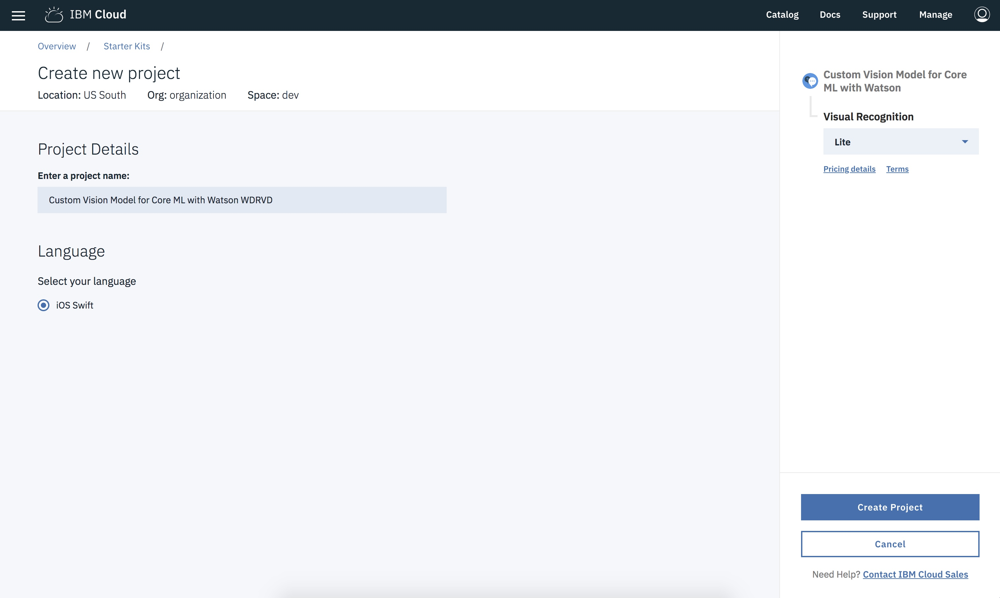
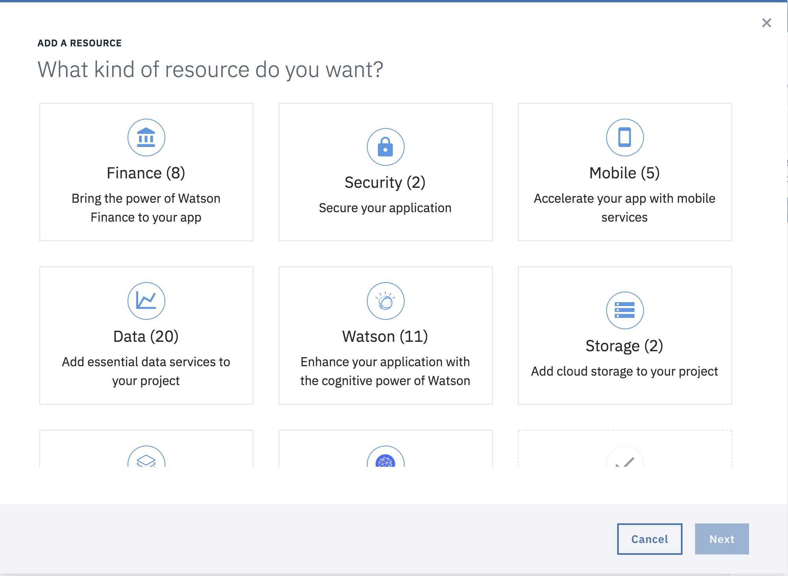

---

copyright:
  years: 2018, 2019
lastupdated: "2019-05-21"

keywords: swift starter kit, apple developer console, download code swift, app details swift, create swift app

subcollection: swift

---

{:new_window: target="_blank"}
{:shortdesc: .shortdesc}
{:screen: .screen}
{:codeblock: .codeblock}
{:pre: .pre}
{:tip: .tip}

# 使用入門範本套件建立 Swift 應用程式
{: #starterkits-intro}

{{site.data.keyword.cloud_notm}} Developer Console for Apple 可讓 Apple 開發人員透過各種入門範本套件建立應用程式、佈建及連接重要的 {{site.data.keyword.cloud_notm}} 最佳化服務，然後快速下載工作中的程式碼，或針對持續交付進行設定。使用者可以建立、檢視、配置及管理您的應用程式，以及下載您應用程式的程式碼。使用入門範本套件可協助您快速評估，並以全新的應用程式來測試 {{site.data.keyword.cloud_notm}} 服務。

準備好了嗎？請立即造訪 [{{site.data.keyword.cloud_notm}} Developer Console for Apple](https://cloud.ibm.com/developer/appledevelopment/starter-kits){: new_window} ，以開始使用。
{: tip}

## 何謂入門範本套件？
{: #starterkits-what}

使用 {{site.data.keyword.cloud_notm}} Developer Experience，您可以從各種入門範本套件中進行選擇。入門範本套件會指示 {{site.data.keyword.cloud_notm}} 以您選擇的語言，動態組裝架構正式作業應用程式，並準備好進行雲端部署。每個入門範本套件都包含一種語言、一個架構以及一個用於特定即時世界使用案例的型樣，其容許重複使用程式碼，而非重建程式碼。

入門範本套件已備妥正式作業，且主要討論利用運行環境（例如，Swift）來示範重要的型樣實作。在某些情況下，入門範本套件提供簡單的使用者體驗，以突顯服務的整合。在其他情況下，入門範本套件代表更準確使用案例的可自訂實作。

入門範本套件包含的指示容許 {{site.data.keyword.cloud_notm}} 使用可攜式程式碼來自動產生有支架的應用程式，並指定在您從入門範本套件建立應用程式時，要自動佈建的服務。

## 使用 {{site.data.keyword.cloud_notm}} Developer Console for Apple
{: #starterkits-journey}

{{site.data.keyword.cloud_notm}} Developer Console for Apple 提供您一個無縫路徑，讓您針對特定使用案例，建置 Swift 新手入門應用程式。讓我們來看看在此過程中您可能採取的步驟。

### 概觀畫面
{: #overview_screen}

「概觀」畫面提供針對一組使用案例而自訂的內容，例如，Watson、Weather 等等。從概觀畫面中，您可以看到文件、存取教育資源、瀏覽服務、看到精選入門範本套件，或鏈結到更龐大的入門範本套件集合。選取導覽區中的 **Starter Kits**，即可進入「入門範本套件」視圖。

{: caption="圖 1. {{site.data.keyword.cloud_notm}} Developer Console for Apple 概觀畫面" caption-side="bottom"}

### 入門範本套件視圖
{: #starter_kits_view}

入門範本套件視圖顯示某使用案例區域所特定的入門範本套件集合。您可以按一下入門範本套件卡上的各種鏈結，以查看展示及相關資訊。選取入門範本套件，以移至「建立應用程式」視圖。

{: caption="圖 2. {{site.data.keyword.cloud_notm}} Developer Console for Apple 入門範本套件視圖" caption-side="bottom"}

### 建立應用程式視圖
{: #create_new_app_view}

從**建立應用程式**視圖，您可以為應用程式命名，以及提供部署及路徑資訊。您也可以看到在您建立應用程式時自動佈建的服務，以及定價方案，與各項的條款。選取**建立**，以移至「應用程式詳細資料」視圖。如果您未登入 {{site.data.keyword.cloud_notm}}，則現在需要進行登入。

{: caption="圖 3. {{site.data.keyword.cloud_notm}} Developer Console for Apple 建立新的應用程式視圖" caption-side="bottom"}

## 應用程式詳細資料視圖
{: #app_details_view}

「應用程式詳細資料」視圖顯示針對應用程式所配置的服務清單。針對清單中的每個項目，您可以看到服務名稱、連接至其他資訊的鏈結，以及一個**動作**按鈕，該按鈕有三個垂直對齊的點。**動作**按鈕選項包含從應用程式移除服務、開啟服務的儀表板以及刪除服務。移除服務實例會移除與此應用程式的關聯，但不會刪除該服務實例。此外，在此視圖上，服務認證合併在一起，因此您不需要造訪每個個別服務實例視圖來取得認證。

{: caption="圖 4. {{site.data.keyword.cloud_notm}} Developer Console for Apple 應用程式詳細資料視圖" caption-side="bottom"}

使用**應用程式詳細資料**視圖，您可以將不屬於原始「入門範本套件」的新服務或現有服務新增至您的應用程式。按一下**新增服務**，以新增服務。可用的服務視應用程式的類型以及地區中可用的服務而定，因此並非所有服務都可與所有應用程式相關聯。

{: caption="圖 5. {{site.data.keyword.cloud_notm}} Developer Console for Apple 新增資源對話框" caption-side="bottom"}

### 下載程式碼

在_應用程式詳細資料_ 頁面上，您可以選取**下載程式碼**，以產生並下載應用程式的程式碼。

### 應用程式清單視圖
{: #app_list_view}

從_應用程式清單_ 視圖中，您可以列出您建立的所有應用程式。您可以從這裡重新命名或刪除應用程式。按一下應用程式名稱列，即可回到「應用程式詳細資料」視圖。

{: caption="圖 6. {{site.data.keyword.cloud_notm}} Developer Console for Apple 應用程式清單視圖" caption-side="bottom"}

如需相關資訊，請造訪[{{site.data.keyword.cloud_notm}} Developer Console for Apple 學習資源](https://cloud.ibm.com/developer/appledevelopment/learning-resources){: new_window} 。
{: tip}
