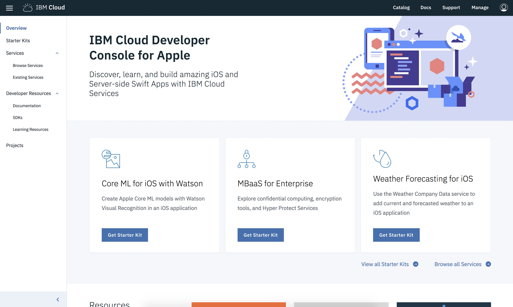

---

copyright:
  years: 2018, 2019
lastupdated: "2019-01-15"

---

{:new_window: target="_blank"}
{:shortdesc: .shortdesc}
{:screen: .screen}
{:codeblock: .codeblock}
{:pre: .pre}
{:tip: .tip}

# Creating Swift apps with Starter Kits
{: #intro}

The {{site.data.keyword.cloud_notm}} Developer Console for Apple enables Apple developers to create apps from various starter kits, provision and connect key {{site.data.keyword.cloud_notm}}-optimized services, and then quickly download working code or set up for continuous delivery. Users are able to create, view, configure, and manage your app, as well as download your app's code. Using starter kits helps you to quickly evaluate, and test {{site.data.keyword.cloud_notm}} services with a brand new app.

Ready to jump in? Visit the [{{site.data.keyword.cloud_notm}} Developer Console for Apple](https://cloud.ibm.com/developer/appledevelopment/starter-kits) now to get started.
{: tip}

## What is a Starter Kit?
{: #starter_kits}

With the {{site.data.keyword.cloud_notm}} Developer Experience, you can choose from various starter kits. Starter kits instruct {{site.data.keyword.cloud_notm}} to dynamically assemble a skeleton production app, in the language of your choice, ready for cloud deployment. Each starter kit embodies a language, a framework, and a pattern for a specific real-world use case that allows reusing code rather than reinventing it.

Starter kits are production-ready, and focus on demonstrating a key pattern implementation by using a runtime (for example Swift). In some cases, starter kits offer a simple user experience to highlight the integration of the service. In other cases, stater kits represent a customizable implementation of a sophisticated use case.

Starter kits contain instructions that allow {{site.data.keyword.cloud_notm}} to automatically produce scaffolded apps with portable code, and specify resources to be auto-provisioned when you create an app from the starter kit.

## Using the {{site.data.keyword.cloud_notm}} Developer Console for Apple
{: #journey}

The {{site.data.keyword.cloud_notm}} Developer Console for Apple gives you a seamless path to building a Swift starter app for your specific use case. Let's look at the steps you might take in your journey.

### Overview screen
{: #overview_screen}

The Overview screen gives you content that is tailored to a set of use cases like Watson, Weather, and more. From the overview screen, you can see documentation, access educational resources, browse services, see featured starter kits, or link to a larger collection of starter kits. Click `Starter Kits` in the left hand navigation area to step into the Starter Kits view.

   *{{site.data.keyword.cloud_notm}} Developer Console for Apple Overview screen*

### Starter Kits view
{: #starter_kits_view}

The Starter Kits view shows the collection of starter kits specific to a use case area. You can click various links on a starter kit card to see demos and more information. Select a starter kit to move to the Create App view.

   *{{site.data.keyword.cloud_notm}} Developer Console for Apple Starter Kits view*

### Create App view
{: #create_new_app_view}

From the **Create App** view, you can name your app, as well as provide deployment and routing information. On the right, you can also see the services that automatically provision when you create your app, along with pricing plans, and terms for each. Click `Create` to move to the App Details view. If you are not logged in to {{site.data.keyword.cloud_notm}}, you need to do so now.

   *{{site.data.keyword.cloud_notm}} Developer Console for Apple Create New App view*

## App Details view
{: #app_details_view}

The App Details view displays a list of services that are configured for your app. For each item in the list, you can see the service name, links to other information, and an **actions** button with three vertically aligned dots. The **actions** button options are to remove services from an app, open dashboard for service, and delete service. Removing a service instance removes the association to this app, and does not delete the service instance. Also, the service credentials are consolidated on this view, so you don't have to visit each individual service instance views to get them.

   *{{site.data.keyword.cloud_notm}} Developer Console for Apple App Details view*

By using the App Details view, you can add new or existing services to your app that were not part of the original Starter Kit. Click the **Add Resource** link in the service list box to add services. The available services depend on the type of app, and the services that are available in a region, so not all services are available to associate with all apps.

   *{{site.data.keyword.cloud_notm}} Developer Console for Apple Add Resource dialog*

### Downloading your code

* On the App Details view, you can access your code by selecting **Download Code** to generate and download the code for your app.

### App List view
{: #app_list_view}

You can list all of your created apps from the App List view. You can rename or delete your apps from here. Click on an app name row to return to the App Details view.

   *{{site.data.keyword.cloud_notm}} Developer Console for Apple App List view*

For more information, visit the [{{site.data.keyword.cloud_notm}} Developer Console for Apple Learning Resources](https://cloud.ibm.com/developer/appledevelopment/learning-resources).
{: tip}
